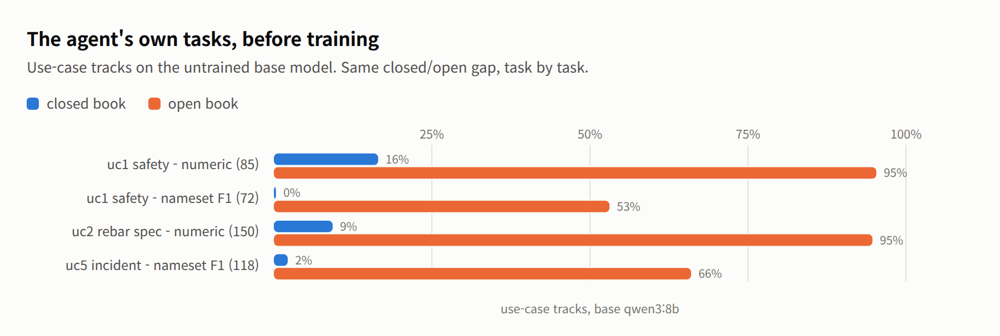
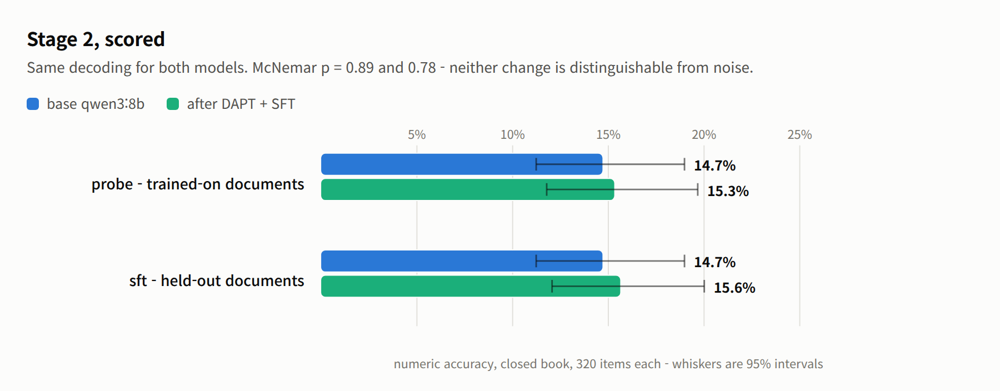
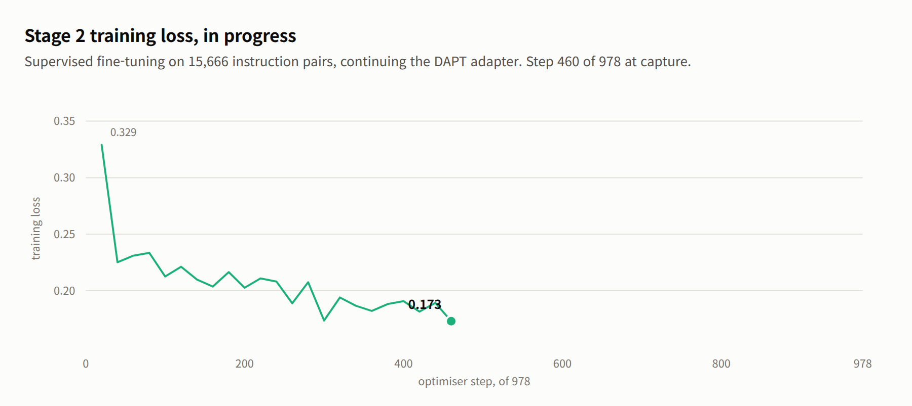

# kcbench

Build a benchmark out of your own document corpus, then measure whether
fine-tuning on that corpus actually taught a model anything.

The question this answers is narrow on purpose: *did training help, and where?*
It compares a base checkpoint against a fine-tuned one on identical frozen
items. It is not a leaderboard. Items are mined from source documents by rule
and verified against the text they came from, not written by domain experts, so
an absolute score means little next to a published benchmark. The delta between
two checkpoints is the number that carries information.

The machinery is domain-agnostic: it takes a directory of chunked documents,
mines factual questions from them, holds out the source material, and scores a
model on what it withheld. It ships configured for the corpus it was built
against — Korean construction standards (KDS/KCS), safety regulation and IFC
building models — which is where the name comes from: **K**orean
**c**onstruction. Everything domain-specific is in `config.json` and a handful
of prompt strings; see [Adapting it to another
domain](#adapting-it-to-another-domain).

## Worked example

How a run of this benchmark reads, from the project it was built for: Qwen3-8B
fine-tuned in two stages — domain-adaptive pre-training over 26,767 raw chunks,
then supervised fine-tuning over 15,666 instruction pairs. Read top to bottom,
the charts are the argument for the benchmark. Every metric named below —
numeric accuracy, nameset F1, perplexity, ECE, McNemar — is defined, with its
source, under [What each metric means](#what-each-metric-means) at the end.

**The training data behind these numbers.** The raw corpus is ~1 GB of Korean
construction documents — design standards (KDS), specifications (KCS), safety
and disaster regulation, quality and inspection, contract and cost, BIM and
smart construction, IFC building models, research reports — thirteen categories
in all, collected from public sources. It was turned into AI-ready training
data (chunked text, instruction pairs, VLM captions) with
[gen_aec_syn_data](https://github.com/mac999/gen_aec_syn_data), a synthetic-data
pipeline by the same author; the processed dataset is available on
[Google Drive](https://drive.google.com/drive/folders/1Cz7S-QhXRwQgsajDDyjBAC8vK30jQQTN?usp=drive_link).
kcbench then split that dataset — the held-out documents became the evaluation
tracks, the rest became `data/train/`, and every number below rests on that
split.

**Known limits of this example dataset, as of August 2026.** The corpus is
still being collected and these figures describe the snapshot the example was
run on, not the dataset's ceiling. The charts below are honest about the corpus
they came from, so its weaknesses belong up front. Nearly all of its
instruction pairs (95%) carry the source clause in the prompt and answer in a
median of 56 characters — it was generated for RAG-style use, so it teaches
extraction and brevity, and stage 2 below shows exactly that signature.
The corpus collects the same regulation more than once, under names differing
by a suffix and as amendment pairs — splitting by document name would have
leaked 759 held-out chunks into training, which is why the split works by
content digest instead. And of its 93 IFC building models, 57 are parser
regression fixtures with one or two elements each; after exclusions only 12
carry enough geometry to ask about, which is why the `vlm` track is 10 items
and read as a smoke test, not a measurement. None of these are benchmark
defects, but every number below should be read knowing them — and the first
one is what the development loop at the end of this example exists to fix.

<picture>
  <source media="(prefers-color-scheme: dark)" srcset="doc/closed-vs-open-dark.png">
  
</picture>

**Start here: is this corpus even worth training on?** Six models that never saw
it, scored on `sft` numeric accuracy. Hand them the clause and they answer
correctly 85–95% of the time — they read Korean regulation fluently. Take the
clause away and none of them clears 17% — they have not memorised any of it.
That gap is the room fine-tuning has to work in, and it is why the closed-book
number is the one this benchmark reports.

<picture>
  <source media="(prefers-color-scheme: dark)" srcset="doc/uc-baseline-dark.png">
  
</picture>

**The same gap holds on the agent's own tasks.** The use-case tracks mirror the
five jobs the fine-tuned agent is being built for — safety lookups, rebar
specification checks, incident analysis. The chart covers three of them, split
by answer type rather than by track, because a numeric accuracy and a nameset
F1 are different measurements and one bar averaging them would hide which moved:
numeric accuracy runs 95% open book against 9–16% closed, nameset F1 53–66%
against 0–2%. The open-book numbers are what matter for the deployed system,
since retrieval will supply the clause; the closed-book floor is what
fine-tuning is trying to raise.

Two things to know before reading the closed-book bars. uc2 and uc5 draw most of
their items from training-side documents — 143 of 150 and 96 of 118 — so their
closed-book figures are probe-style diagnostics, not held-out measurements; run
files break both out under `by_split`. And the two use cases missing from the
chart are missing for a reason: uc3 is a vision task with no clause to withhold,
and uc4 is scored on abstention, which belongs on its own axis.

**uc4 is the exception worth naming.** Given a swapped, unrelated clause, the
base model correctly abstains 95% of the time — refusing to invent is one thing
it already does well. That number is an abstention rate rather than one of the
accuracy bars above, and it is an open-book measurement: withholding the passage
from an item whose whole question is whether the passage supports an answer
would leave nothing to be faithful to.

<picture>
  <source media="(prefers-color-scheme: dark)" srcset="doc/dapt-perplexity-dark.png">
  
</picture>

**Did training move anything?** Perplexity on 5,381 held-out chunks fell 40%,
7.589 → 4.553, in every one of the thirteen categories. The two that stayed
highest — research reports, uncategorised documents — are the two least like the
regulation prose the corpus is mostly made of, which is the answer you would
expect if the model were learning the domain rather than the dataset.

<picture>
  <source media="(prefers-color-scheme: dark)" srcset="doc/dapt-loss-dark.png">
  
</picture>

**The training run itself was uneventful.** Loss fell from 2.091 to 1.452 over
836 steps and the curve has nothing odd in it. Worth showing precisely because
of the next chart: a clean loss curve and a 40% perplexity drop are not evidence
that the model got better at its job.

<picture>
  <source media="(prefers-color-scheme: dark)" srcset="doc/probe-regression-dark.png">
  
</picture>

**This is the measurement the other three cannot give you.** Asked questions
whose answers sit in the documents it just trained on, the fine-tuned checkpoint
answered fewer of them than the base model it started from — numeric accuracy,
closed book, over the probe's 320 numeric items — while perplexity on the same
corpus had just improved 40%. No other track here could have shown that.

The first reading of the gap was wrong, and the correction is the more useful
result. It looked like continued pre-training had destroyed the model's ability
to follow an instruction: 2.9% correct, and 43% of replies containing no answer
at all. The checkpoint had been registered with Ollama under a pass-through
template and no stop tokens, so it was prompted without the chat markers the
base model got and was never told where to stop. Served the way its base is
served, the same weights answer 11.4% and fall silent on 28% — most of the
collapse was the harness.

Most, not all. 11.4% against a base of 16.9%, and 28% silence against none, is
still a real regression: stage 1 did cost this checkpoint some of its ability to
answer, which is what stage 2 exists to restore. Both readings were wrong in
the same direction — the first overstated the damage, and the impulse to call
the whole thing a harness bug would understate it.

Two things worth keeping from that. A benchmark comparing two checkpoints has to
serve them identically, and nothing in the scoring code checks that. And a
result that looks like a dramatic model failure deserves to be suspected of
being a harness failure first — this one was caught because the symptom, every
reply running to the generation limit, was too uniform to be a property of a
model.

<picture>
  <source media="(prefers-color-scheme: dark)" srcset="doc/stage2-scored-dark.png">
  
</picture>

**And the verdict, after stage 2.** With the format damage repaired and both
models decoded identically, the fine-tuned checkpoint scores within noise of
its base on both tracks — McNemar p = 0.89 on the probe, 0.78 on `sft`. Both
are numeric accuracy, closed book, over the 320 numeric items each track
carries. Of those 320 probe items the fine-tune gained 26 and lost 24: churn,
not learning. The training pipeline restored what stage 1 had broken and added
no measurable closed-book knowledge, and the loss curves alone — 2.09 → 1.45,
then 0.33 → 0.11, both textbook — would never have said so. That is the
benchmark's case in one pair of bars: every other signal reported success.

<picture>
  <source media="(prefers-color-scheme: dark)" srcset="doc/sft-loss-dark.png">
  
</picture>

**The stage 2 run itself, for the record.** Two epochs, healthy curve, no
anomalies. Its absolute values are not comparable to the stage 1 curve — SFT
masks the prompt and scores only the answer tokens, an easier objective. A
clean curve and a null result are the same story told twice: nothing about
training dynamics says whether anything was learned.


**The rest of the picture, from the remaining tracks.** Scored the same way,
the fine-tune is not uniformly a null result. Its calibration improved
dramatically: expected calibration error over the same 320 numeric items
halved, 0.641 → 0.320 (Brier 0.554 → 0.226) — the base model repeats the same
wrong number at 78% self-consistency, while the fine-tune's samples disagree
when it does not know. On the agent's use-case tracks, the faithfulness
behaviour survived training (abstention on swapped clauses 0.95 → 0.93, and
accuracy on unmodified controls improved 0.875 → 0.938), and incident analysis
improved significantly (uc5 nameset F1 +0.096 [+0.03, +0.17], fuzzy matching)
while safety-list enumeration regressed the same way `sft` did (uc1 nameset F1
−0.148 [−0.24, −0.06], exact matching — the two F1s are not scored by the same
matcher). And the self-check validation earned its keep by failing honestly:
sampling consistency separates wrong answers from right ones by 0.026 —
nothing — because 61% of this model's wrong answers are *consistently* wrong,
which is the same confident-hallucination behaviour
the calibration number measures. A hallucination detector that assumes invented
facts vary across samples does not work on a model that invents them stably.

That is the whole argument for building a benchmark this way. Perplexity said
the training worked. The probe set said what it had cost. You need both numbers,
on frozen items, before and after, or you are guessing.

### Every figure above, as score tables

No new results here — this is the same run the charts plot and the prose quotes,
gathered so a number can be looked up rather than hunted for. The limits stated
at the top of this section govern all of it. `qwen3:8b` before any fine-tuning,
on the `kcbench` instantiation:

| Metric | Items | Score |
|---|---:|---:|
| `dapt` perplexity | 5,381 chunks | 7.589 |
| `sft` numeric, closed book | 320 | 0.166 |
| `sft` nameset F1, closed book | 75 | 0.000 |
| `sft` numeric, open book | 320 | 0.953 |
| `sft` nameset F1, open book | 75 | 0.582 |
| probe numeric, closed book | 320 | 0.169 |
| probe nameset F1, closed book | 80 | 0.000 |

The closed-open gap is the corpus doing its job: the model reads these
documents competently and knows almost nothing in them from memory. Probe and
`sft` sit at the same number before training, which is what should happen —
nothing has been learned yet, so trained-on and held-out documents are equally
unfamiliar. They are expected to separate afterwards, and how they separate is
the diagnosis.

After stage 1 (domain-adaptive pre-training, 836 steps, LoRA on Qwen3-8B):

| Metric | Base | After DAPT | Change | Items |
|---|---:|---:|---:|---:|
| `dapt` perplexity | 7.589 | 4.553 | -40.0% | 5,381 chunks |
| probe numeric, closed book | 0.169 | 0.114 | -32.5% | 325 of 400 |
| probe replies with no answer | 0.000 | 0.283 | — | 325 of 400 |

After stage 2 (SFT, 978 steps on 15,666 instruction pairs, continuing the DAPT
adapter), scored with identical decoding for both models (`--think off`,
temperature 0):

| Metric | Base | After DAPT+SFT | Significance | Items |
|---|---:|---:|---|---:|
| probe numeric, closed book | 0.147 | 0.153 | p = 0.89, noise | 320 |
| `sft` numeric, closed book | 0.147 | 0.156 | p = 0.78, noise | 320 |
| `sft` numeric, open book | 0.944 | 0.959 | p = 0.18, noise | 320 |
| `sft` nameset F1, open book | 0.587 | 0.379 | **−0.21 [−0.29, −0.12], significant** | 75 |
| `sft` ECE, closed book | 0.641 | **0.320** | self-consistency, 8 samples | 320 |
| uc4 faithfulness, open book | 0.912 | 0.931 | p = 0.51, preserved | 160 |
| uc5 incident F1, open book | 0.468 | 0.564 | **+0.10 [+0.03, +0.17], significant** | 118 |
| uc1 nameset F1, open book | 0.473 | 0.325 | −0.15 [−0.24, −0.06], significant | 72 |
| replies with no answer | 0.000 | 0.000 | — | — |

The base numbers differ from the first table because the decoding differs:
these runs disable the reasoning pass so that the fine-tune — trained with
`enable_thinking=False` — and its base are served the same format. Neither
delta is distinguishable from noise: stage 2 repaired the answer format stage 1
had damaged and added no measurable closed-book knowledge. The two-stage
pipeline needs rework before its scores are worth reporting further — likely
suspects are the LoRA rank and single-epoch stage 1.

The stage 1 probe figures are from 325 of the 400 items; that run was stopped
there to free the GPU, and its journal is kept so it resumes rather than
restarts. An earlier run of the same checkpoint scored 0.029 with 43% silence —
that one was served without its chat template and stop tokens, and is the reason
the registration step is spelled out in the [Workflow](#workflow).

## Design: holdout and probe

A benchmark carved out of the same corpus a model trained on answers only half
the question. If a fine-tuned model scores well on held-out documents, it
generalized. If it scores badly, you cannot tell whether training failed or
whether the answers were never in the training data to begin with.

So kcbench builds two sets from one corpus:

| Set | Drawn from | Answer present in training data | Question it answers |
|---|---|---:|---|
| holdout tracks | documents withheld from training | 25% | does it generalize to unseen text |
| probe | documents the model trained on | 83% | did it acquire what was taught |

The probe is deliberately contaminated — every item carries
`split: "train"` and `contamination: "intentional"`, and probe scores must
never be reported as benchmark results. Its value is diagnostic, and it comes
from reading the two together:

| After training | Reading |
|---|---|
| probe up, holdout up | acquired and generalized |
| probe up, holdout flat | memorized the corpus, did not generalize |
| both flat | training did not take |

Those percentages are measured, not assumed: `build_probe.py` checks each item's
subject and answer against the training rows and reports the share that are
jointly present.

## Tracks

A track is one self-contained set of items with its own answer type and its own
score — the sense the word carries in TREC. Each answers a different question, so
they are read separately, never averaged into a single figure. Tracks are named
for what they test:

| Track | Items | Answer type | What it measures |
|---|---:|---|---|
| `dapt` | 5,381 chunks | perplexity | fit to held-out text — did pre-training take |
| `sft` | 395 | numeric 320, nameset 75 | held-out QA — does it generalise to unseen regulation |
| `vlm` | 10 | nameset 6, mapping 4 | vision: element types from renders, model-to-photo mapping |
| `probe` | 400 | numeric 320, nameset 80 | training-side QA — did it acquire what it was taught. Diagnostic only |
| `uc1_safety` | 157 | numeric 85, nameset 72 | safety regulation lookup |
| `uc2_rebar_spec` | 150 | numeric 150 | specification limits and tolerances |
| `uc3_bim_site` | 39 | label 39 | render and site photo judged together |
| `uc4_faithfulness` | 160 | faithfulness 160 | abstention when the passage does not support an answer |
| `uc5_incident` | 118 | nameset 118 | causes and controls from incident reports |

`--tracks uc` runs every use-case track. Use-case tracks are registered in
`config.json`, so adding one takes a config entry rather than a code change.

`dapt`, `sft` and `vlm` were originally numbered 1, 2 and 3, for the training
stage each diagnoses. The numbers are still accepted — `--tracks 2` is `--tracks
sft` — and run files still key on them, so scores from older runs stay
comparable. Nothing else needs them.

Grading is by answer type, and every type has precedent in a published
benchmark — the mapping is in
[benchmark/README.md](benchmark/README.md#precedent-for-each-grading-type).
What each type scores, and what the rest of the numbers in a run file mean, is
set out under [What each metric means](#what-each-metric-means) near the end.

## Install

Python 3.11 or newer.

```
pip install requests                        # building and scoring
pip install torch transformers              # dapt perplexity
pip install torch transformers peft         # fine-tuning under training/
```

Scoring goes through an [Ollama](https://ollama.com) server for `sft`, `vlm`
and the use-case tracks. `dapt` loads the checkpoint locally instead, because
perplexity needs logprobs over a fixed text rather than generation.

```
ollama serve
ollama pull qwen3:8b
```

## Use

Everything runs through one entry point, `cb.py`. Each command takes its own
flags, shown by `python cb.py <command> -h`.

| Command | What it does |
|---|---|
| `build` | run every build stage in order |
| `holdout` | reserve the evaluation documents |
| `tracks` | mine the dapt, sft and vlm items from the held-out documents |
| `probe` | mine the training-side probe set |
| `usecases` | build the use-case tracks from the config registry |
| `split` | write the training split, holdout excluded |
| `verify` | trace every item to its source and prove nothing trains on it |
| `eval` | score a model over the generation tracks |
| `ppl` | score the dapt track's perplexity locally |
| `ece` | expected calibration error — is the model's confidence justified |
| `compare` | compare two runs, with a significance test |
| `matrix` | score several models and tabulate |
| `triage` | pick the items a human should review |
| `review` | apply review verdicts, kept across rebuilds |
| `export` | package the built benchmark, with an lm-eval-harness config |

Build the benchmark from a corpus. `build` runs the stages in order: split the
holdout, mine the tracks, mine the probe, build the use-case tracks, write the
training split, verify provenance, then export.

```
python cb.py build
python cb.py build -i /data/my_corpus -o /tmp/bench --config my.json
```

Score a model, once per book setting:

```
python cb.py eval -m qwen3:8b       --tag base  --tracks sft --closed-book
python cb.py eval -m my-finetune:v1 --tag ft-v1 --tracks sft --closed-book
python cb.py ppl  -m ./out/my-dapt  --tag ft-v1-ppl        # the dapt track
```

Ask whether its confidence is worth anything — expected calibration error over
the same items:

```
python cb.py ece -m my-finetune:v1 --tag ft-v1-ece --tracks sft --closed-book
```

Compare them. This is the step that produces the answer:

```
python cb.py compare --base base --after ft-v1 --markdown report.md
```

Score several models side by side:

```
python cb.py matrix --models qwen3:8b,qwen3:14b,glm4:9b --tracks sft --book both
```

Long runs journal every scored item, so a run that dies resumes rather than
restarting. `run_resumable.sh` adds the retry loop around it:

```
./run_resumable.sh my-finetune:v1 ft-probe:probe ft-t2:2
```

Two guards stop a dead inference server from being scored as a bad model: a run
of failed calls aborts the track, and so does a run of blank replies, which is
what a server that answers but no longer generates looks like. Neither writes a
score file. The journal survives, so restarting picks up where it stopped.

## The development loop

A benchmark like this is one half of a cycle; the other half is what you do
about the numbers. The intended loop is the standard data-centric one:

```
measure -> diagnose which capability is missing -> fix the TRAINING DATA
        -> retrain -> measure again, same frozen items
```

The instrument never changes inside the loop. What changes is the training set,
because that is where the diagnosis almost always points: in the worked example
above, closed-book recall stayed flat not because the model lacked capacity but
because 95% of the instruction pairs carried the source clause in the prompt —
the training taught extraction and the benchmark asked for recall. That is a
dataset design gap, and no amount of hyperparameter tuning fixes a task that
was never trained.

Editing training data in response to benchmark findings is legitimate practice
— FLAN and T0 mix zero-context and reading-comprehension formats deliberately,
and the knowledge-injection literature prescribes paraphrase diversity for
facts — but only on one side of a line:

| Legitimate | Goodharting |
|---|---|
| add the missing *format* or *capability* to the training data | plant the held-out answers in the training data |
| iterate against `probe` (intentionally contaminated, diagnostic) | iterate against the held-out tracks until they look good |
| re-measure on the same frozen items | change the items when the score disappoints |

kcbench enforces the line mechanically: the training split excludes held-out
text by content digest, `cb.py verify` re-proves it after any data change, and
the probe/holdout pair exists so that iteration pressure lands on the
deliberately contaminated set rather than the one that decides the result.

`training/augment_sft.py` is the worked example's own turn of this loop. It
started with two transformations aimed at the capabilities the benchmark showed
missing — closed-book variants of the open-book pairs, and full-enumeration
pairs mined from the training-side chunks — and the second measured turn added
two more that its results demanded: LLM-generated paraphrases of each
closed-book question (a fact stated one way is stored but not extractable) and
refusal-target pairs with swapped clauses (because closed-book training alone
taught answering without support). Every ratio and cap is a flag, because the
right mixture is an empirical question the next measurement answers; the flag
table is in [training/README.md](training/README.md).

The example's fine-tunes are numbered by turn — each is the same base model and
the same stage 1 adapter, retrained at stage 2 on a different data recipe, then
scored on the same frozen items. That is the whole experimental design: the
version number counts trips around the loop, nothing else.

| Version | Stage 2 data | Pairs | What the turn tested |
|---|---|---:|---|
| `v1` | the original pairs, as generated | 15,666 | the dataset as designed (for RAG) |
| `v2` | + closed-book variants, + enumeration pairs | 22,249 | can recall and full lists be trained in |
| `v3` | + LLM paraphrases, + refusal-target pairs | 32,080 | does fact repetition inject recall; does trained refusal survive hard cases |

That measurement has since been taken — stage 2 was retrained on the augmented
set (22,249 pairs) and rescored on the same frozen items — and it answered all
three ways a turn of the loop can:

- **One fix validated.** The 637 enumeration pairs moved open-book nameset F1
  0.379 → 0.491 (+0.11, interval [+0.05, +0.18]), recovering more than half of
  the regression. The mechanism was the mechanism.
- **One fix refuted.** 5,946 closed-book variants moved probe recall not at
  all — 0.153 → 0.128, still level with the untrained base. Asking from memory
  once per fact does not put the fact into a rank-64 adapter; the
  knowledge-injection literature's prescription (many paraphrases per fact,
  more pre-training passes) is the next candidate, and it is a data-generation
  and budget question, not a mixing-ratio question.
- **One tradeoff surfaced.** Training the model to answer without a clause also
  taught it to answer when the clause does not support one: abstention on
  swapped clauses fell 0.925 → 0.750 (p = 0.0005), the first significant
  regression on the safety track across the whole example. A closed-book
  mixture needs abstention pairs alongside it, or it trades recall it does not
  gain for honesty it had.

The third turn tested the refined recipe — 7,692 LLM-generated paraphrases of
the closed-book questions and 1,920 refusal-target pairs — and both prescriptions
failed on their own metrics. Recall stayed at the base rate (0.156, p = 0.78),
which after three attempts closes the question: SFT-side augmentation does not
put facts into this adapter, and the remaining levers are on the pre-training
side — paraphrase-augmented DAPT text, more passes, or more adapter capacity.
Abstention stayed where v2 left it (0.750): the refusal pairs swapped in clauses
from unrelated documents, which are easy to recognise as unrelated, while the
faithfulness track swaps in plausible same-corpus clauses — a refusal trained on
easy negatives does not transfer to hard ones. Meanwhile calibration improved
for the third straight turn (ECE 0.641 → 0.281) and answering on supported
clauses reached 0.988, the best of any checkpoint.

Three turns in, the honest summary is that this pipeline reliably improves how
the model handles what it is given — calibration, reading, answering with
support — and has not moved what the model knows. For the RAG agent the corpus
was built for, the first half is the half that matters, and the checkpoint to
deploy on safety grounds is still v1, the only fine-tune that kept abstention
intact.

Which is the loop working as intended: two measurements in, the dataset's
authors know one thing to keep, one thing not to scale, and one interaction
they would not have predicted.

### What this benchmark is good at, and not

Good at: before/after deltas on frozen items; telling acquisition from
generalisation (probe vs holdout); catching harness faults (three were found by
its own runs: a serving-template mismatch, a reasoning-parse mismatch, and a
grader format bias); calibration and abstention, which scores alone miss.

Not good at: absolute rankings against public leaderboards (items are
rule-mined, not expert-written); judging free-form prose (extractive answer
types only — `selfcheck` is the reference-free aid there, and its own
validation showed consistency is no hallucination signal on a model that
hallucinates stably); vision beyond a smoke test (`vlm` is 10 items).

## Workflow

What the commands look like end to end, on the question this was built for:
*we assembled a corpus and fine-tuned on it — did that help?* Times are from a
GB10 workstation scoring an 8B model through Ollama.

**1. Build the benchmark, once.** This splits the corpus, mines the items, and
writes the training split with the held-out documents removed. Run it before
any training: the split is what makes the later numbers mean anything.

```bash
python cb.py build -i /data/my_corpus --strict
```

`--strict` fails the build if an item turns out to be contaminated rather than
warning and continuing. Do not change `holdout.seed` after this point — a
different seed reserves different documents, and two runs on different items
are not comparable.

**2. Baseline the checkpoint you are about to fine-tune.** Every number below
is meaningless without its "before". This is the step people skip and then
cannot interpret anything.

```bash
python cb.py ppl  -m Qwen/Qwen3-8B --tag base-ppl              # ~4.5 h, local weights
python cb.py eval -m qwen3:8b --tag base-closed --tracks sft --closed-book
python cb.py eval -m qwen3:8b --tag base-open   --tracks sft   # reading, not knowledge
python cb.py eval -m qwen3:8b --tag base-probe  --tracks probe --closed-book
```

The closed/open gap here tells you whether the corpus is worth training on at
all. If the model already answers closed-book, there is nothing to teach it; if
it cannot answer open-book, the items are broken rather than hard.

**3. Train, on `data/train/` and nothing else.**

```bash
python ../training/dapt.py                                     # stage 1
python ../training/sft.py --base ../training/out/qwen3-8b-dapt # stage 2
python ../training/merge.py -a ../training/out/qwen3-8b-sft -o ../training/out/merged
```

**4. Register the fine-tuned model the same way as its base.** This step is
easy to get wrong and it invalidates everything after it. A merged checkpoint
served without its chat template and stop tokens is prompted differently from
the base model it is being compared against, and the difference shows up as a
model failure that is not one.

```bash
ollama show qwen3:8b --modelfile > Modelfile.ft     # take the base's template
# edit FROM to point at the new gguf, keep TEMPLATE and every PARAMETER stop
ollama create my-ft:v1 -f Modelfile.ft
```

Check it before scoring: `ollama show my-ft:v1 --modelfile` must show a real
`TEMPLATE` and the `PARAMETER stop` lines, not `TEMPLATE {{ .Prompt }}`.

**5. Score the fine-tuned checkpoint on the same items.** Same tracks, same
flags, same config as step 2.

```bash
python cb.py ppl  -m ../training/out/merged --tag ft-ppl
./run_resumable.sh my-ft:v1 ft-probe:probe ft-closed:sft
python cb.py eval -m my-ft:v1 --tag ft-open --tracks sft
```

`run_resumable.sh` journals each item and retries, which is what you want for a
multi-hour run. A bare `cb.py eval` is fine for anything under an hour.

**6. Compare. This is the answer.**

```bash
python cb.py compare --base base-ppl    --after ft-ppl    --markdown ppl.md
python cb.py compare --base base-closed --after ft-closed --markdown sft.md
python cb.py compare --base base-probe  --after ft-probe  --markdown probe.md
```

Read the three together, and read the probe against the held-out `sft` track:

| probe | sft (held out) | Reading |
|---|---|---|
| up | up | it learned the domain and generalised |
| up | flat | it memorised the corpus and did not generalise |
| flat | flat | training did not take — check perplexity moved at all |
| down | down | something broke. Suspect the harness before the model |

**7. Optional, once the above is understood.** Two questions the score cannot
answer:

```bash
python cb.py ece       -m my-ft:v1 --tag ft-ece --tracks sft --closed-book
python cb.py selfcheck -m my-ft:v1 --tag ft-sc  --tracks sft --closed-book
```

`ece` asks whether its confidence is worth anything — the dangerous failure is
being wrong and sure. `selfcheck` asks the same question without an answer key,
by sampling the model and seeing whether it tells the same story twice, so it
also works on the free-form answers no track can grade.

## Layout

```
benchmark/
  cb.py                  the only entry point: build, eval, ppl, compare, ...
  config.json            every tunable, overridden by command-line flags
  run_resumable.sh       supervisor: retry, resume, stop when stuck
  data/                  built artefacts; evaluation sets are tracked, the rest is rebuilt
  kcbench/
    build_holdout.py     choose the documents to withhold
    build_tracks.py      mine tracks 1-3 from the held-out documents
    build_probe.py       mine the probe from the trained-on documents
    build_usecases.py    build the use-case tracks from the config registry
    build_all.py         run the build stages in order
    make_train_split.py  write the training split, holdout excluded
    verify_provenance.py prove where each item came from and that nothing trains on it
    evaluate.py          score a model over the generation tracks
    perplexity.py        score the dapt track locally
    compare.py           compare two runs, with a bootstrap significance test
    calibration.py       expected calibration error: is its confidence justified
    run_matrix.py        score several models and tabulate
    triage_items.py      pick the items a human should look at
    apply_review.py      fold human review decisions back into the set
    export_dataset.py    package the built benchmark, with an lm-eval-harness config
    common.py            config resolution, paths, shared helpers
training/
  dapt.py                stage 1, domain-adaptive pre-training
  sft.py                 stage 2, supervised fine-tuning
  merge.py               fold the adapter into the base weights
```

`training/` is kept separate from `benchmark/` deliberately: an instrument that
shares code with the thing it measures stops being one.

## Adapting it to another domain

Everything tunable lives in `config.json`, and every value there is overridden
by the matching command-line flag. The parts worth knowing:

- `corpus_dir`, `generated_dir`, `out_dir` — where documents are read and
  artefacts are written.
- `holdout` — what fraction of chunks to withhold, per-document caps, and the
  seed. The seed is what makes a split reproducible.
- `track2_sft`, `probe` — how many items to mine, per-document caps, and the
  filters that decide whether a mined fact is answerable: numeric uniqueness,
  subject length bounds, minimum set size for nameset items.
- `usecases` — a registry. Adding a use-case track is a config entry plus a
  track file; `cb.py eval --tracks uc` picks up whatever is enabled without a
  code change.
- `eval` — endpoint, context and prediction lengths, temperature, repeats,
  numeric tolerance, and the two dead-server guards.

What is domain-specific and would need editing: the prompt strings for the
vision tracks in `kcbench/build_tracks.py` and `build_usecases.py`, which name IFC
classes and construction site photos, and the IFC reader itself. The text
tracks make no assumption about subject matter beyond the corpus being chunked
prose with numbers and named lists in it.

Prompts default to Korean because the reference corpus is Korean regulation and
translating the terms changes the question. Every item carries an English
prompt as well (`question_en`, and `answer_en` for numeric units), so
`--lang en` scores the same answer key in English.

## What each metric means

A run produces numbers in four layers: how an answer is graded, whether the
score can be trusted, what the score cannot see, and the before/after comparison
that is the actual result. Each layer is reported separately — nothing here is
averaged into a single figure.

### 1. Six ways to grade an answer

Every item declares an `eval_type`, and that decides how its reply is graded.
The types are not comparable with each other, so a track carrying two of them
reports two numbers rather than their mean.

| Type | Score | Range | Read as |
|---|---|---|---|
| `numeric` | accuracy | 0–1 | share of stated thresholds recalled |
| `nameset` | precision / recall / **F1** | 0–1 | how much of a list was recovered |
| `label` | accuracy | 0–1 | share of classifications correct |
| `faithfulness` | accuracy + **abstention rate** | 0–1 | does it refuse when unsupported |
| `mapping` | key F1 + value accuracy | 0–1 | named the right things, counted them right |
| perplexity | perplexity | 1–∞, **lower is better** | fit to unseen text |

Three more numbers are not grading types — they are asked of the model about
its own answers, and defined in section 3 below:

| Metric | Score | Range | Read as |
|---|---|---|---|
| **ECE** (`cb.py ece`) | calibration error | 0–1, **lower is better** | does it know when it is right |
| Brier (beside ECE) | squared error of confidence | 0–1, lower is better | accuracy and calibration in one number |
| inconsistency (`cb.py selfcheck`) | 1 − sampling agreement | 0–1 | does it tell the same story twice, no answer key needed |

**`numeric` — the first number in the reply, within 2% relative tolerance.**
*"What is the minimum thickness?"* → `40mm`. An item is right or wrong and the
track reports the share right. This is the bulk of the benchmark: 320 of the 395
`sft` items and 320 of the 400 probe items.

**`nameset` — set F1, so a partial answer scores partially.** *"List the items
in paragraph 3"* has four right answers, and a model naming three of them has
not failed. Precision is the share of what the model said that was right; recall
is the share of the answer key it found; F1 is their harmonic mean and is the
number reported. Both halves are needed — precision alone rewards a model that
offers only its safest guess, recall alone rewards one that lists everything it
can think of, and F1 requires both.

Two matching modes, and they are not interchangeable. **Exact** matching
compares normalised strings, which is what `sft`, `probe`, `vlm` and `uc1` use.
**Fuzzy** matching counts a predicted line as a hit when it covers 60% of a gold
item's content words, which `uc5` uses because its answers are clause-length
prose a model will legitimately abbreviate or renumber. An F1 from one is not an
F1 from the other; the tracks say which they use.

**`label` — the first vocabulary word in the reply wins.** `uc3` puts a BIM
render and a site photograph side by side and asks for `match`, `partial_match`
or `mismatch`. Position rather than membership, because the vocabulary overlaps
itself — `partial_match` contains `match` — and a reply naming several labels
has to be read as its first commitment.

**`faithfulness` — abstention where abstention is the right answer.** Half the
items in `uc4` carry a swapped, unrelated passage; the other half carry the
genuine one.

| Item | Correct behaviour |
|---|---|
| passage swapped | abstain — say the passage does not support an answer |
| passage genuine | answer, and answer correctly |

The halves are equal in number on purpose: a model that abstained on everything
would score 100% on the swapped half alone. The abstention rate is reported next
to accuracy for the same reason, so that behaviour is visible rather than
inferred from a single figure.

**`mapping` — keys and values scored apart.** *"How many of each element
type?"* is two questions: did it name the right types (key F1), and did it count
them (value accuracy). A model that lists the catalogue correctly and guesses
every count is a different failure from one that misses half the types, and one
combined number would hide which happened.

**perplexity — the only metric here where lower is better.** No question is
asked: held-out text is run through the weights and the score is how surprised
the model was by it. The measure is
[Jelinek, Mercer, Bahl and Baker's (1977)](https://doi.org/10.1121/1.2016299),
proposed to say how hard a speech recognition task is and still the standard way
to state how well a language model fits a text. It says the model has grown
familiar with the prose. It does not say the model can answer a question about
it, and the difference is the reason the other five types exist — in the worked
example above, perplexity fell 40% while closed-book recall did not move at
all.

### 2. Two checks on whether a score is real

**`no_answer` — the share of replies containing no answer at all.** A wrong
answer and a missing answer both score zero and mean opposite things. An
inference server that has gone away, an exhausted token budget, or a reasoning
model that emits an empty think block and stops all produce the second. This
field is what caught the worked example's serving bug: 2.9% correct looked like
a destroyed model until `no_answer` showed that 43% of the replies were empty.

**`*_ci95` — a 95%
[Wilson (1927)](https://doi.org/10.1080/01621459.1927.10502953) interval on
every proportion.** A 39-item track and a 320-item track can print the same
`0.15` and mean very different things by it, and the interval puts that
difference on the page instead of leaving it to be remembered. Wilson's
construction rather than the textbook normal one because these tracks sit in
exactly the regime — small n, p near 0 — where the normal interval puts the
lower bound below zero.

### 3. Two questions a score cannot answer

**Expected Calibration Error — `cb.py ece`.** Not *is it right* but *does it
know when it is right*, because the dangerous failure is being wrong and sure.
A model that states no probability has to be asked more than once, so the same
question goes in eight times at temperature 0.7 and the modal answer's share
becomes its confidence — self-consistency, after
[Wang et al. (2022)](https://arxiv.org/abs/2203.11171). ECE is then the average
gap between that confidence and actual accuracy, taken over confidence bins:
the binned estimator of
[Naeini, Cooper and Hauskrecht (2015)](https://ojs.aaai.org/index.php/AAAI/article/view/9602),
in the form [Guo et al. (2017)](https://arxiv.org/abs/1706.04599) made standard
for neural networks. Lower is better and 0 is perfect. The
[Brier score (1950)](https://journals.ametsoc.org/view/journals/mwre/78/1/1520-0493_1950_078_0001_vofeit_2_0_co_2.xml),
reported beside it, asks the same question without the bins and comes from
weather forecasting, where being confidently wrong has always been the
expensive failure. Covers `numeric` and `label` items only.

**Inconsistency — `cb.py selfcheck`.** A hallucination signal that needs no
answer key, so it also works on free-form answers no track can grade. Sample the
same question several times: a fact the weights hold comes back the same way, an
invented one drifts. That is
[SelfCheckGPT (Manakul, Liusie and Gales, EMNLP 2023)](https://aclanthology.org/2023.emnlp-main.557/),
reduced here to the one comparison an extractive answer allows. It reports
`separation` as its own validation — how much higher the inconsistency runs on
answers that were in fact wrong. On the worked example that came out at 0.026,
meaning the detector does not work on this model, which is a result worth having
and is why the number is printed rather than the flag rate alone.

### 4. The comparison, which is the actual result

Everything above describes one checkpoint. `cb.py compare` is what the benchmark
exists to produce.

**Delta** is the subtraction, and on its own it is not evidence.

**[McNemar's exact test](https://doi.org/10.1007/BF02295996)**, for binary
metrics. McNemar wrote it in 1947 for correlated proportions, which is exactly
what two runs over one frozen item set produce: the runs answered the *same*
questions, so they are paired, and only the items whose verdict changed carry
information about the change. Reported as gained, lost and a p-value:

> 320 probe items, 26 gained, 24 lost, p = 0.89

A large p means the data cannot distinguish the change from noise. Read as an
unpaired difference of two aggregates, those same numbers read as a 0.6-point
improvement — which is the mistake the paired test exists to prevent.

**Paired bootstrap**, for continuous metrics such as F1, reporting a 95%
interval on the mean per-item change. The resampling procedure is
[Koehn's (2004)](https://aclanthology.org/W04-3250/), introduced for this
problem exactly — deciding whether one system really beats another on a test
set too small for a raw difference to be trusted:

| Interval | Reading |
|---|---|
| `[+0.03, +0.17]` | real improvement |
| `[−0.29, −0.12]` | real regression |
| `[−0.05, +0.08]` | indistinguishable from no change |

An interval straddling zero means the data does not separate this change from
nothing, whatever the point estimate says.

### The two axes every number sits on

No score above means anything without both of them stated.

**Closed book or open book.** Open book supplies the passage, so the item tests
reading comprehension; closed book withholds it, so the item tests what the
weights hold. Both are scored against the same answer key. Fine-tuning has
almost no room to move an open-book score — the answer is on the page — which is
why the closed-book number is the one this benchmark reports, and why the
open-book number is the one that matters for a system that will retrieve the
clause anyway.

**Probe or holdout.** The same kind of question mined from opposite sides of the
split: probe from documents the model trained on, holdout from documents
withheld from it. They are read as a pair, never singly — the table under
[Design: holdout and probe](#design-holdout-and-probe) says what each
combination means, and step 6 of the [Workflow](#workflow) reads it against a
real run.

### Where these come from

Nothing above is this project's invention, which is the point: a reviewer should
be able to recognise what is being computed without reading the code.

| Metric | Source |
|---|---|
| perplexity | Jelinek, Mercer, Bahl & Baker, [*Perplexity — a measure of the difficulty of speech recognition tasks*](https://doi.org/10.1121/1.2016299), JASA 62 (1977) |
| Wilson interval | E. B. Wilson, [*Probable Inference, the Law of Succession, and Statistical Inference*](https://doi.org/10.1080/01621459.1927.10502953), JASA 22 (1927) |
| Expected Calibration Error | Naeini, Cooper & Hauskrecht, [*Obtaining Well Calibrated Probabilities Using Bayesian Binning*](https://ojs.aaai.org/index.php/AAAI/article/view/9602), AAAI (2015); Guo, Pleiss, Sun & Weinberger, [*On Calibration of Modern Neural Networks*](https://arxiv.org/abs/1706.04599), ICML (2017) |
| confidence by self-consistency | Wang et al., [*Self-Consistency Improves Chain of Thought Reasoning in Language Models*](https://arxiv.org/abs/2203.11171) (2022) |
| Brier score | G. W. Brier, [*Verification of Forecasts Expressed in Terms of Probability*](https://journals.ametsoc.org/view/journals/mwre/78/1/1520-0493_1950_078_0001_vofeit_2_0_co_2.xml), Monthly Weather Review 78 (1950) |
| inconsistency / selfcheck | Manakul, Liusie & Gales, [*SelfCheckGPT: Zero-Resource Black-Box Hallucination Detection*](https://aclanthology.org/2023.emnlp-main.557/), EMNLP (2023) |
| McNemar's test | Q. McNemar, [*Note on the sampling error of the difference between correlated proportions or percentages*](https://doi.org/10.1007/BF02295996), Psychometrika 12 (1947) |
| paired bootstrap | P. Koehn, [*Statistical Significance Tests for Machine Translation Evaluation*](https://aclanthology.org/W04-3250/), EMNLP (2004) |

The grading types themselves — which published benchmark each one follows, and
why — are tabulated separately in
[benchmark/README.md](benchmark/README.md#precedent-for-each-grading-type).

## Limits

Items are mined and verified by rule, not authored by domain experts. That
makes the set cheap to rebuild and easy to audit — `cb.py verify`
traces every item to its source span — but it also means the questions test
recall of stated facts rather than judgement. `vlm` is small (10 items) and
should be read as a smoke test rather than a measurement. The use-case tracks
range from 39 to 160 items, which is in line with per-task sizes in published
benchmarks but still small enough that single-digit differences are noise;
`cb.py compare` runs a bootstrap test so that this is visible rather than
assumed.

The corpus itself is not distributed. Source documents are Korean government
standards and regulations, and the training split and `dapt` chunks are
derived closely enough from them that redistribution is a licensing question
rather than a technical one. The evaluation sets are included: they hold mined
question-answer pairs and citations, not the source text.
