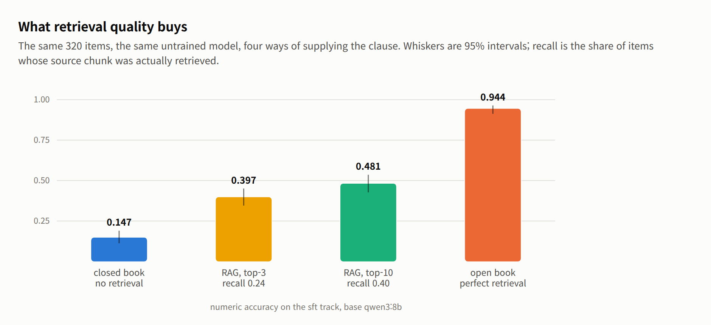

# kcbench

Build a benchmark out of your own document corpus, then measure whether
fine-tuning on that corpus actually taught a model anything.

The question this answers is narrow on purpose: *did training help, and where?*
It compares a base checkpoint against a fine-tuned one on identical frozen
items. It is not a leaderboard. Items are mined from source documents by rule
and verified against the text they came from, not written by domain experts, so
an absolute score means little next to a published benchmark. The delta between
two checkpoints is the number that carries information.

The machinery is domain-agnostic: it takes a directory of chunked documents,
mines factual questions from them, holds out the source material, and scores a
model on what it withheld. It ships configured for the corpus it was built
against — Korean construction standards (KDS/KCS), safety regulation and IFC
building models — which is where the name comes from: **K**orean
**c**onstruction. Everything domain-specific is in `config.json` and a handful
of prompt strings; see [Adapting it to another
domain](#adapting-it-to-another-domain).

To use it, start at [Install](#install). To see what it produces and what it
found, read the [worked example](#worked-example-a-korean-construction-corpus) — a full campaign on the
corpus it was built for, charts and score tables included.

Everything also runs from a browser. `cb.py webview` serves a local page laid
out the way the benchmark is used: the frozen item sets and their answer keys on
the left, the checkpoints scored against them on the right, and in the middle
whatever you select — items, a render, or a run file drawn as charts. See
[The browser view](#the-browser-view).


**Contents**

- [Install](#install) — dependencies, and the inference server
- [Use](#use) — the seventeen commands, and what each does
- [Evaluation design](#evaluation-design--held-out-and-contaminated-probe-sets) — the held-out and probe sets, and why one is contaminated on purpose
- [Data-centric development loop](#data-centric-development-loop) — what to do with the numbers, and the line against Goodharting
- [Workflow](#workflow) — build, baseline, train, register, score, compare — in order
- [Layout](#layout) — what each file in the repository does
- [Worked example](#worked-example-a-korean-construction-corpus) — Qwen3-8B on Korean construction regulation: the headline results
- [Track reference](#track-reference--item-counts-and-answer-types) — the nine item sets, their sizes and answer types
- [Retrieval ablation and item validity](#retrieval-ablation-and-item-validity) — where the detail lives
- [System design implications](#system-design-implications) — what the findings imply for the system that motivated them
- [Adapting it to another domain](#adapting-it-to-another-domain) — what to change when the corpus is not construction
- [Metric reference](#metric-reference) — every number in a run file, defined and sourced
- [Limits](#limits) — what this benchmark cannot decide

The three longest sections live in their own files so this one stays readable:
[doc/worked-example.md](doc/worked-example.md) (the full campaign),
[doc/retrieval-and-validity.md](doc/retrieval-and-validity.md),
[doc/metrics.md](doc/metrics.md).

## Install

Python 3.11 or newer.

```
pip install requests                        # building and scoring
pip install flask                           # the browser view, and only that
pip install torch transformers              # dapt perplexity
pip install torch transformers peft         # fine-tuning under training/
```

Scoring goes through an [Ollama](https://ollama.com) server for `sft`, `vlm`
and the use-case tracks. `dapt` loads the checkpoint locally instead, because
perplexity needs logprobs over a fixed text rather than generation.

```
ollama serve
ollama pull qwen3:8b
```

## Use

Everything runs through one entry point, `cb.py`. Each command takes its own
flags, shown by `python cb.py <command> -h`. Commands that take `--tracks` take
the names listed under [What each track contains](#track-reference--item-counts-and-answer-types).

| Command | What it does |
|---|---|
| `build` | run every build stage in order |
| `holdout` | reserve the evaluation documents |
| `tracks` | mine the dapt, sft and vlm items from the held-out documents |
| `probe` | mine the training-side probe set |
| `usecases` | build the use-case tracks from the config registry |
| `split` | write the training split, holdout excluded |
| `verify` | trace every item to its source and prove nothing trains on it |
| `eval` | score a model over the generation tracks |
| `ppl` | score the dapt track's perplexity locally |
| `ece` | expected calibration error — is the model's confidence justified |
| `compare` | compare two runs, with a significance test |
| `rag` | score with retrieved context instead of the gold clause |
| `matrix` | score several models and tabulate |
| `triage` | pick the items a human should review |
| `review` | apply review verdicts, kept across rebuilds |
| `export` | package the built benchmark, with an lm-eval-harness config |
| `webview` | browse and run the whole thing in a browser |

Build the benchmark from a corpus. `build` runs the stages in order: split the
holdout, mine the tracks, mine the probe, build the use-case tracks, write the
training split, verify provenance, then export.

```
python cb.py build
python cb.py build -i /data/my_corpus -o /tmp/bench --config my.json
```

Score a model, once per book setting:

```
python cb.py eval -m qwen3:8b       --tag base  --tracks sft --closed-book
python cb.py eval -m my-finetune:v1 --tag ft-v1 --tracks sft --closed-book
python cb.py ppl  -m ./out/my-dapt  --tag ft-v1-ppl        # the dapt track
```

Ask whether its confidence is worth anything — expected calibration error over
the same items:

```
python cb.py ece -m my-finetune:v1 --tag ft-v1-ece --tracks sft --closed-book
```

Compare them. This is the step that produces the answer:

```
python cb.py compare --base base --after ft-v1 --markdown report.md
```

Score several models side by side:

```
python cb.py matrix --models qwen3:8b,qwen3:14b,glm4:9b --tracks sft --book both
```

Long runs journal every scored item, so a run that dies resumes rather than
restarting. `run_resumable.sh` adds the retry loop around it:

```
./run_resumable.sh my-finetune:v1 ft-probe:probe ft-t2:2
```

Two guards stop a dead inference server from being scored as a bad model: a run
of failed calls aborts the track, and so does a run of blank replies, which is
what a server that answers but no longer generates looks like. Neither writes a
score file. The journal survives, so restarting picks up where it stopped.

### The browser view

`webview` serves a local page that runs these same commands and renders what
they produced. It is useful when you are reading items rather than scripting a
run — a mined question next to the passage it came from, a site photo beside the
item that asks about it, a run file as a scored dashboard instead of raw JSON.

```
python cb.py webview                       # opens http://127.0.0.1:8799
python cb.py webview --port 8800 --no-browser
webview.bat  --no-browser                  # the same, under a named environment
./webview.sh --no-browser
```

The two launchers exist because the page usually runs from a different
interpreter than the one on `PATH`. Both pass every argument through to
`cb.py webview`, check that Flask is installed before starting, and take the
interpreter from `KCBENCH_PY` — the same variable `training/pipeline_sft.sh`
uses — falling back to a venv named `venv_lmm`. `webview.sh` also accepts
`KCBENCH_VENV` and finds either a Windows or a POSIX layout under it.

| Flag | Default | What it does |
|---|---|---|
| `--port N` | `8799` | port to serve on |
| `--host ADDR` | `127.0.0.1` | interface to bind. Anything but localhost serves the corpus to the network and lets whoever reaches it start a command; the log says so when you do it |
| `--no-browser` | off | do not open a browser window on start |
| `--debug` | off | Flask's debug reloader, for working on the page itself |
| `-c, --config FILE` | `./config.json` | the settings file the page reads, edits and runs commands against |
| `-o, --out-dir DIR` | from config | where run files are read from and commands write to |

It needs Flask, which nothing else in the benchmark does; `pip install flask`
and the module says so if it is missing. It takes the same path flags as every
other command (`-i`, `--corpus-dir`, `--metadata-dir`), so a page can be pointed
at any dataset variant the way a command can.

The page is arranged the way the benchmark is used, not the way the disk is
laid out. On the left is the benchmark itself: one card per item set with its
count, answer types and how many items are training-side — the answer key,
which is what a before/after comparison rests on. Open one and its items read
with the expected answer on the same line as the question. The corpus and
generated data sit behind a second tab, since scoring never reads them, and
`config.json` is editable in a third. On the right are the checkpoints scored
against those items, one card each; tick several and press Chart to draw them
on identical items, which is the only comparison this benchmark treats as
meaningful. The middle opens on the seven-step workflow from this README, each
step loading its command into the bar above, and thereafter shows whatever was
selected: paged records, a render or site photo on a canvas, a run file as bar
charts with 95% intervals, a `compare` file as a delta chart with its
significance. Selecting any folder that holds run files charts the folder. The
command bar across the top builds the argument line as you fill it in and shows
the `cb.py` invocation it will run; the log panel underneath streams the running
command live. Draggable splitters between all of it, dark and light themes,
Korean and English, all remembered per browser.

It is a reader and a launcher, not a second implementation: every number it
draws is read back out of a run file an ordinary command wrote, so the page
cannot disagree with what `cb.py` reports. It writes in two places only —
starting a command, and saving `config.json`, which keeps a `.bak`. It binds to
localhost, refuses paths outside the directories the config names, and runs one
command at a time, because scoring loads a model and `ppl` loads a second copy
locally: on a unified-memory box, two at once is what kills long runs.

## Evaluation design — held-out and contaminated probe sets

A benchmark carved out of the same corpus a model trained on answers only half
the question. If a fine-tuned model scores well on held-out documents, it
generalized. If it scores badly, you cannot tell whether training failed or
whether the answers were never in the training data to begin with.

So kcbench builds two sets from one corpus:

| Set | Drawn from | Answer present in training data | Question it answers |
|---|---|---:|---|
| holdout tracks | documents withheld from training | 25% | does it generalize to unseen text |
| probe | documents the model trained on | 83% | did it acquire what was taught |

The probe is deliberately contaminated — every item carries
`split: "train"` and `contamination: "intentional"`, and probe scores must
never be reported as benchmark results. Its value is diagnostic, and it comes
from reading the two together:

| After training | Reading |
|---|---|
| probe up, holdout up | acquired and generalized |
| probe up, holdout flat | memorized the corpus, did not generalize |
| both flat | training did not take |

Those percentages are measured, not assumed: `build_probe.py` checks each item's
subject and answer against the training rows and reports the share that are
jointly present.

## Data-centric development loop

A benchmark like this is one half of a cycle; the other half is what you do
about the numbers. The intended loop is the standard data-centric one:

```
measure -> diagnose which capability is missing -> fix the TRAINING DATA
        -> retrain -> measure again, same frozen items
```

The instrument never changes inside the loop. What changes is the training set,
because that is where the diagnosis almost always points: in the worked example
below, closed-book recall stayed flat not because the model lacked capacity but
because 95% of the instruction pairs carried the source clause in the prompt —
the training taught extraction and the benchmark asked for recall. That is a
dataset design gap, and no amount of hyperparameter tuning fixes a task that
was never trained.

Editing training data in response to benchmark findings is legitimate practice
— FLAN and T0 mix zero-context and reading-comprehension formats deliberately,
and the knowledge-injection literature prescribes paraphrase diversity for
facts — but only on one side of a line:

| Legitimate | Goodharting |
|---|---|
| add the missing *format* or *capability* to the training data | plant the held-out answers in the training data |
| iterate against `probe` (intentionally contaminated, diagnostic) | iterate against the held-out tracks until they look good |
| re-measure on the same frozen items | change the items when the score disappoints |

kcbench enforces the line mechanically: the training split excludes held-out
text by content digest, `cb.py verify` re-proves it after any data change, and
the probe/holdout pair exists so that iteration pressure lands on the
deliberately contaminated set rather than the one that decides the result.

`training/augment_sft.py` is the tool this loop drives: it rewrites the
training pairs toward whatever the last measurement showed missing —
closed-book variants, full-enumeration pairs, LLM-generated paraphrases,
refusal targets. Every ratio and cap is a flag, because the right mixture is an
empirical question the next measurement answers; the flag table is in
[training/README.md](training/README.md), and the three measured turns it
produced are reported in [doc/worked-example.md](doc/worked-example.md#per-recipe-results).

A turn returns one of three things — a fix validated, a fix refuted, a tradeoff
surfaced — and all three are worth having. The worked example ran four turns,
augmenting the training pairs a different way each time, and got all three.

### Scope and known weaknesses

Good at: before/after deltas on frozen items; telling acquisition from
generalisation (probe vs holdout); catching harness faults (three were found by
its own runs: a serving-template mismatch, a reasoning-parse mismatch, and a
grader format bias); calibration and abstention, which scores alone miss.

Not good at: absolute rankings against public leaderboards (items are
rule-mined, not expert-written); judging free-form prose (extractive answer
types only — `selfcheck` is the reference-free aid there, and its own
validation showed consistency is no hallucination signal on a model that
hallucinates stably); vision beyond a smoke test (`vlm` is 10 items).

## Workflow

What the commands look like end to end, on the question this was built for:
*we assembled a corpus and fine-tuned on it — did that help?* Times are from a
GB10 workstation scoring an 8B model through Ollama.

**1. Build the benchmark, once.** This splits the corpus, mines the items, and
writes the training split with the held-out documents removed. Run it before
any training: the split is what makes the later numbers mean anything.

```bash
python cb.py build -i /data/my_corpus --strict
```

`--strict` fails the build if an item turns out to be contaminated rather than
warning and continuing. Do not change `holdout.seed` after this point — a
different seed reserves different documents, and two runs on different items
are not comparable.

**2. Baseline the checkpoint you are about to fine-tune.** Every number below
is meaningless without its "before". This is the step people skip and then
cannot interpret anything.

```bash
python cb.py ppl  -m Qwen/Qwen3-8B --tag base-ppl              # ~4.5 h, local weights
python cb.py eval -m qwen3:8b --tag base-closed --tracks sft --closed-book
python cb.py eval -m qwen3:8b --tag base-open   --tracks sft   # reading, not knowledge
python cb.py eval -m qwen3:8b --tag base-probe  --tracks probe --closed-book
```

The closed/open gap here tells you whether the corpus is worth training on at
all. If the model already answers closed-book, there is nothing to teach it; if
it cannot answer open-book, the items are broken rather than hard.

**3. Train, on `data/train/` and nothing else.** On a unified-memory machine,
train with nothing else on the box — a concurrent `cb.py ppl` loads a second
full copy of the model and a concurrent `cb.py eval` keeps Ollama resident, and
the three together have been enough to have the kernel kill the training run.
Add `--checkpointing` if memory is tight; [training/README.md](training/README.md)
has the budget.

```bash
python ../training/dapt.py                                     # stage 1
python ../training/sft.py --base ../training/out/qwen3-8b-dapt # stage 2
python ../training/merge.py -a ../training/out/qwen3-8b-sft -o ../training/out/merged
```

**4. Register the fine-tuned model the same way as its base.** This step is
easy to get wrong and it invalidates everything after it. A merged checkpoint
served without its chat template and stop tokens is prompted differently from
the base model it is being compared against, and the difference shows up as a
model failure that is not one.

```bash
ollama show qwen3:8b --modelfile > Modelfile.ft     # take the base's template
# edit FROM to point at the new gguf, keep TEMPLATE and every PARAMETER stop
ollama create my-ft:v1 -f Modelfile.ft
```

Check it before scoring: `ollama show my-ft:v1 --modelfile` must show a real
`TEMPLATE` and the `PARAMETER stop` lines, not `TEMPLATE {{ .Prompt }}`.

**5. Score the fine-tuned checkpoint on the same items.** Same tracks, same
flags, same config as step 2.

```bash
python cb.py ppl  -m ../training/out/merged --tag ft-ppl
./run_resumable.sh my-ft:v1 ft-probe:probe ft-closed:sft
python cb.py eval -m my-ft:v1 --tag ft-open --tracks sft
```

`run_resumable.sh` journals each item and retries, which is what you want for a
multi-hour run. A bare `cb.py eval` is fine for anything under an hour.

**6. Compare. This is the answer.**

```bash
python cb.py compare --base base-ppl    --after ft-ppl    --markdown ppl.md
python cb.py compare --base base-closed --after ft-closed --markdown sft.md
python cb.py compare --base base-probe  --after ft-probe  --markdown probe.md
```

Read the three together, and read the probe against the held-out `sft` track:

| probe | sft (held out) | Reading |
|---|---|---|
| up | up | it learned the domain and generalised |
| up | flat | it memorised the corpus and did not generalise |
| flat | flat | training did not take — check perplexity moved at all |
| down | down | something broke. Suspect the harness before the model |

**7. Optional, once the above is understood.** Two questions the score cannot
answer:

```bash
python cb.py ece       -m my-ft:v1 --tag ft-ece --tracks sft --closed-book
python cb.py selfcheck -m my-ft:v1 --tag ft-sc  --tracks sft --closed-book
```

`ece` asks whether its confidence is worth anything — the dangerous failure is
being wrong and sure. `selfcheck` asks the same question without an answer key,
by sampling the model and seeing whether it tells the same story twice, so it
also works on the free-form answers no track can grade.

## Layout

```
benchmark/
  cb.py                  the only entry point: build, eval, ppl, compare, ...
  config.json            every tunable, overridden by command-line flags
  run_resumable.sh       supervisor: retry, resume, stop when stuck
  webview.bat / .sh      start the browser view under the venv KCBENCH_PY names
  data/                  built artefacts; evaluation sets are tracked, the rest is rebuilt
  kcbench/
    build_holdout.py     choose the documents to withhold
    build_tracks.py      mine tracks 1-3 from the held-out documents
    build_probe.py       mine the probe from the trained-on documents
    build_usecases.py    build the use-case tracks from the config registry
    build_verdict.py     mine the verdict track from threshold items
    build_all.py         run the build stages in order
    make_train_split.py  write the training split, holdout excluded
    verify_provenance.py prove where each item came from and that nothing trains on it
    evaluate.py          score a model over the generation tracks
    perplexity.py        score the dapt track locally
    compare.py           compare two runs, with a bootstrap significance test
    calibration.py       expected calibration error: is its confidence justified
    run_matrix.py        score several models and tabulate
    triage_items.py      pick the items a human should look at
    apply_review.py      fold human review decisions back into the set
    export_dataset.py    package the built benchmark, with an lm-eval-harness config
    rag_baseline.py      score with retrieved context instead of the gold clause
    selfcheck.py         sampling-consistency hallucination signal, no answer key
    webview.py           serve the browser view
    webui/               the page it serves: index.html, app.js, style.css
    common.py            config resolution, paths, shared helpers
training/
  dapt.py                stage 1, domain-adaptive pre-training
  sft.py                 stage 2, supervised fine-tuning
  merge.py               fold the adapter into the base weights
```

`training/` is kept separate from `benchmark/` deliberately: an instrument that
shares code with the thing it measures stops being one.

## Worked example: a Korean construction corpus

Qwen3-8B fine-tuned in two stages over ~1 GB of Korean construction regulation
— domain-adaptive pre-training on 26,767 chunks, then SFT on 15,666 instruction
pairs — and scored on every track. The headlines are below; the full write-up,
with all charts, per-recipe results and score tables, is in
[doc/worked-example.md](doc/worked-example.md).

**What it was for.** The metrics were not chosen as the right way to judge DAPT
or SFT. They were run to find out *which metrics register a difference at all*
when the training data changes — an experiment on the instrument as much as on
the model. Several turned out not to move.

### Retrieval beat fine-tuning, and not by a little

<picture>
  <source media="(prefers-color-scheme: dark)" srcset="doc/rag-dark.png">
  
</picture>

| Condition | recall@k | numeric |
|---|---:|---:|
| closed book, no retrieval | — | 0.147 |
| RAG, English-centred embedder, top-10 | 0.041 | 0.144 |
| RAG, `bge-m3`, top-10 | 0.400 | **0.481** |
| open book (perfect retrieval) | 1.000 | 0.944 |

Swapping the embedder moved accuracy 0.334. Four rounds of fine-tuning moved it
0.009. An embedder that cannot search the language buys nothing at all and
fails silently — it returns passages, the model answers, and only the score
shows the passages were unrelated.

Read task by task: anything *written down somewhere and revised periodically* —
clause text, dimensional thresholds, specification limits — is better looked up
than memorised, and a revised standard costs a re-index rather than a retrain.
Fine-tuning earned its place on the other kind of task, about *how* the model
answers rather than *what* it knows: output format, calibration, use of a
clause once supplied. Anyone reading these numbers as a verdict on fine-tuning
should first ask which kind their own task is.

### What the training data could and could not explain

An audit of the instruction pairs against the items they are scored on found
three faults, of which only the first is about size:

| Fault | Measured | Why it matters |
|---|---|---|
| **Scale** | 3.7M tokens, one pass, LoRA rank 64 | too few exposures per fact for recall to form |
| **Format mismatch** | 82% of training answers are prose; 81% of scored items ask for a bare figure | the model was never shown the task it is graded on. **More data does not fix this** |
| **Distribution mismatch** | equipment and services is 3.2% of training against 17.0% of the evaluation | the categories weighted most at scoring time are the thinnest in training |

The format mismatch is the sharpest. Across a 3,000-pair sample **no training
instruction asks for a bare number at all**, so a model holding the fact can
still score zero for expressing it the way it was taught to. That is a
data-design fault, not a capacity one, and it is repairable with the corpus
already in hand.

Three things the same audit found healthy, so they are not candidate
explanations: duplication is low, answers are reconstructed rather than copied
out of the clause, and question types do not collapse onto one form.

### The two-stage result

Scored with identical decoding for both models (`--think off`, temperature 0):

| Metric | Base | After DAPT+SFT | Significance |
|---|---:|---:|---|
| `sft` numeric, closed book | 0.147 | 0.156 | p = 0.78, noise |
| `sft` numeric, open book | 0.944 | 0.959 | p = 0.18, noise |
| `sft` nameset F1, open book | 0.587 | 0.379 | **−0.21, significant** |
| `sft` ECE, closed book | 0.641 | **0.320** | calibration improved |
| uc5 incident F1, open book | 0.468 | 0.564 | **+0.10, significant** |

Stage 2 repaired the answer format stage 1 had damaged and added no measurable
closed-book knowledge. Closed-book recall was flat across all four recipes.

> **Size your own run against this before reading it as a verdict.** The
> central negative result is a statement about *this corpus at this scale and
> this adapter size*, roughly three orders of magnitude below the token budgets
> at which continued pre-training is normally reported to add knowledge. If
> your corpus is this size, the honest expectation is what was measured here:
> better handling of text you supply at inference, and no new knowledge in the
> weights. Useful for a RAG system, poor if you needed answers from memory.

Full detail — scoring protocol, the four-recipe ablation, per-recipe results,
complete score tables, and the dataset's known limits — is in
[doc/worked-example.md](doc/worked-example.md). The retrieval sweep and the
item-validity audit are in
[doc/retrieval-and-validity.md](doc/retrieval-and-validity.md).

## Track reference — item counts and answer types

A track is one self-contained set of items with its own answer type and its own
score — the sense the word carries in TREC. Each answers a different question, so
they are read separately, never averaged into a single figure. Tracks are named
for what they test:

| Track | Items | Answer type | What it measures |
|---|---:|---|---|
| `dapt` | 5,381 chunks | perplexity | fit to held-out text — did pre-training take |
| `sft` | 395 | numeric 320, nameset 75 | held-out QA — does it generalise to unseen regulation |
| `vlm` | 10 | nameset 6, mapping 4 | vision: element types from renders, model-to-photo mapping |
| `probe` | 400 | numeric 320, nameset 80 | training-side QA — did it acquire what it was taught. Diagnostic only |
| `uc1_safety` | 157 | numeric 85, nameset 72 | safety regulation lookup |
| `uc2_rebar_spec` | 150 | numeric 150 | specification limits and tolerances |
| `uc3_bim_site` | 39 | label 39 | render and site photo judged together |
| `uc4_faithfulness` | 160 | faithfulness 160 | abstention when the passage does not support an answer |
| `uc5_incident` | 118 | nameset 118 | causes and controls from incident reports |
| `uc6_verdict` | 810 | verdict 810 | compliance judgement against a stated threshold |

`--tracks uc` runs every use-case track. Use-case tracks are registered in
`config.json`, so adding one takes a config entry rather than a code change.

`dapt`, `sft` and `vlm` were originally numbered 1, 2 and 3, for the training
stage each diagnoses. The numbers are still accepted — `--tracks 2` is `--tracks
sft` — and run files still key on them, so scores from older runs stay
comparable. Nothing else needs them.

Grading is by answer type, and every type has precedent in a published
benchmark — the mapping is in
[benchmark/README.md](benchmark/README.md#precedent-for-each-grading-type).
What each type scores, and what the rest of the numbers in a run file mean, is
set out in [doc/metrics.md](doc/metrics.md).

## Retrieval ablation and item validity

How much of a score the retriever decides rather than the model, and how much
of the item set is measurable without an expert reviewer:
[doc/retrieval-and-validity.md](doc/retrieval-and-validity.md). The headline —
a better embedder bought 0.334 accuracy where four training recipes bought
0.009 — is in the worked example above.

## System design implications

Three findings from the campaign above constrain how the agent that motivated it
should be built. Fine-tuning moved output quality and never moved knowledge.
Retrieval quality is worth more than any training recipe tried — a good embedder
bought roughly 0.35 accuracy, four data recipes bought none. And every attempt to
train refusal made refusal worse, at every dose.

[solution.md](solution.md) works those through into design decisions: why the
generating and the verifying roles are better separated than trained into one
set of weights, and four ways to implement that split in ascending order of cost
— starting with detaching the adapter, since the un-adapted base model is
already the best abstainer measured here. It covers what the abstention collapse
is best explained by and the one grader check that should precede believing it,
why the retrieval budget comes first and what recall target is worth chasing,
the latency arithmetic for the machine these runs were made on (an NVIDIA DGX
Spark, GB10 Grace Blackwell), and a list of what to validate before committing
to any of it.

Those are that project's conclusions rather than the benchmark's — the
benchmark only supplies the numbers, and the document opens by saying what they
are conditioned on: a 3.7M-token corpus of synthetic pairs, a rank-64 adapter,
128 GB of GPU memory, and one base model. Change any of those and the answers
may change. The reasoning transfers further than the figures do.

## Adapting it to another domain

Everything tunable lives in `config.json`, and every value there is overridden
by the matching command-line flag. The parts worth knowing:

- `corpus_dir`, `generated_dir`, `out_dir` — where documents are read and
  artefacts are written. The `images` paths carried by `vlm` and `uc3` items are
  relative to **`generated_dir`**, not `corpus_dir`: the renders and site photos
  are produced alongside the chunked text, so a run whose `generated_dir` does
  not hold them scores those tracks as unanswerable rather than failing loudly.
  `benchmark/data/uc3_cross_image.jsonl` ships with the repository; the images it
  names do not, for the same licensing reason the `dapt` chunks are withheld.
- `holdout` — what fraction of chunks to withhold, per-document caps, and the
  seed. The seed is what makes a split reproducible.
- `track2_sft`, `probe` — how many items to mine, per-document caps, and the
  filters that decide whether a mined fact is answerable: numeric uniqueness,
  subject length bounds, minimum set size for nameset items.
- `usecases` — a registry. Adding a use-case track is a config entry plus a
  track file; `cb.py eval --tracks uc` picks up whatever is enabled without a
  code change.
- `eval` — endpoint, context and prediction lengths, temperature, repeats,
  numeric tolerance, and the two dead-server guards.

What is domain-specific and would need editing: the prompt strings for the
vision tracks in `kcbench/build_tracks.py` and `build_usecases.py`, which name IFC
classes and construction site photos, and the IFC reader itself. The text
tracks make no assumption about subject matter beyond the corpus being chunked
prose with numbers and named lists in it.

Prompts default to Korean because the reference corpus is Korean regulation and
translating the terms changes the question. Every item carries an English
prompt as well (`question_en`, and `answer_en` for numeric units), so
`--lang en` scores the same answer key in English.

## Metric reference

Every metric this benchmark reports — what it is, how it is graded, and where
the definition comes from — is in [doc/metrics.md](doc/metrics.md): answer
types and grading rules, reliability checks, calibration and consistency,
significance testing, and the two axes every score is read on.

## Limits

Items are mined and verified by rule, not authored by domain experts. That
makes the set cheap to rebuild and easy to audit — `cb.py verify`
traces every item to its source span — but it also means the questions test
recall of stated facts rather than judgement. `vlm` is small (10 items) and
should be read as a smoke test rather than a measurement. The use-case tracks
range from 39 to 160 items, which is in line with per-task sizes in published
benchmarks but still small enough that single-digit differences are noise;
`cb.py compare` runs a bootstrap test so that this is visible rather than
assumed.

The corpus itself is not distributed. Source documents are Korean government
standards and regulations, and the training split and `dapt` chunks are
derived closely enough from them that redistribution is a licensing question
rather than a technical one. The evaluation sets are included: they hold mined
question-answer pairs and citations, not the source text.
