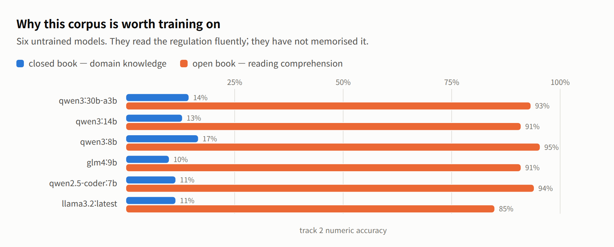
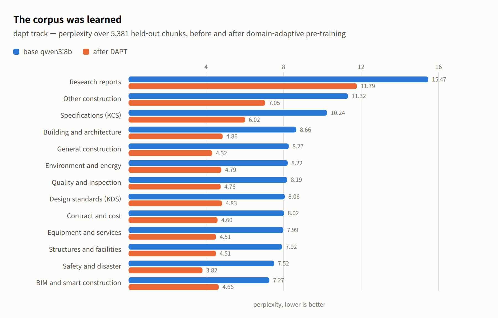
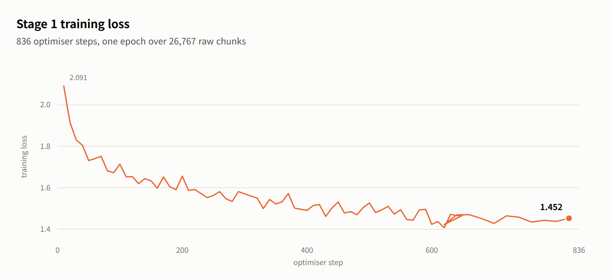
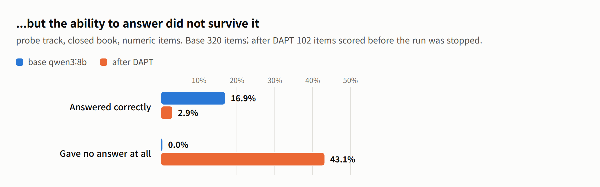

# kcbench

Build a benchmark out of your own document corpus, then measure whether
fine-tuning on that corpus actually taught a model anything.

The question this answers is narrow on purpose: *did training help, and where?*
It compares a base checkpoint against a fine-tuned one on identical frozen
items. It is not a leaderboard. Items are mined from source documents by rule
and verified against the text they came from, not written by domain experts, so
an absolute score means little next to a published benchmark. The delta between
two checkpoints is the number that carries information.

The machinery is domain-agnostic: it takes a directory of chunked documents,
mines factual questions from them, holds out the source material, and scores a
model on what it withheld. It ships configured for the corpus it was built
against — Korean construction standards (KDS/KCS), safety regulation and IFC
building models — which is where the name comes from: **K**orean
**c**onstruction. Everything domain-specific is in `config.json` and a handful
of prompt strings; see [Adapting it to another
domain](#adapting-it-to-another-domain).

## What it looks like

A worked example, from the run this was built for: Qwen3-8B given
domain-adaptive pre-training on 26,767 chunks of Korean construction regulation.
Four charts, and between them they tell you what the benchmark is for.

<picture>
  <source media="(prefers-color-scheme: dark)" srcset="doc/closed-vs-open-dark.png">
  
</picture>

**Start here: is this corpus even worth training on?** Six models that never saw
it. Hand them the clause and they answer correctly 85–95% of the time — they read
Korean regulation fluently. Take the clause away and none of them clears 17% —
they have not memorised any of it. That gap is the room fine-tuning has to work
in, and it is why the closed-book number is the one this benchmark reports.

<picture>
  <source media="(prefers-color-scheme: dark)" srcset="doc/dapt-perplexity-dark.png">
  
</picture>

**Did training move anything?** Perplexity on 5,381 held-out chunks fell 40%,
7.589 → 4.553, in every one of the thirteen categories. The two that stayed
highest — research reports, uncategorised documents — are the two least like the
regulation prose the corpus is mostly made of, which is the answer you would
expect if the model were learning the domain rather than the dataset.

<picture>
  <source media="(prefers-color-scheme: dark)" srcset="doc/dapt-loss-dark.png">
  
</picture>

**The training run itself was uneventful.** Loss fell from 2.091 to 1.452 over
836 steps and the curve has nothing odd in it. Worth showing precisely because
of the next chart: a clean loss curve and a 40% perplexity drop are not evidence
that the model got better at its job.

<picture>
  <source media="(prefers-color-scheme: dark)" srcset="doc/probe-regression-dark.png">
  
</picture>

**This is the measurement the other three cannot give you.** Asked questions
whose answers are in the documents it just trained on, the model got *worse* —
16.9% → 2.9% — and 43% of its replies contain no answer at all, against none
before. It had stopped answering questions and started continuing text: asked
`2 + 2`, it emits a reasoning block containing a different question and then a
list of choices, where the base model says `4`. Continued pre-training on raw
regulation cost it the ability to follow an instruction. Supervised fine-tuning
is the stage that teaches answer shape, and that is the next run.

That is the whole argument for building a benchmark this way. Perplexity said
the training worked. The probe set said what it had cost. You need both numbers,
on frozen items, before and after, or you are guessing.

## Why a held-out set is not enough

A benchmark carved out of the same corpus a model trained on answers only half
the question. If a fine-tuned model scores well on held-out documents, it
generalized. If it scores badly, you cannot tell whether training failed or
whether the answers were never in the training data to begin with.

So kcbench builds two sets from one corpus:

| Set | Drawn from | Answer present in training data | Question it answers |
|---|---|---:|---|
| holdout tracks | documents withheld from training | 25% | does it generalize to unseen text |
| probe | documents the model trained on | 83% | did it acquire what was taught |

The probe is deliberately contaminated — every item carries
`split: "train"` and `contamination: "intentional"`, and probe scores must
never be reported as benchmark results. Its value is diagnostic, and it comes
from reading the two together:

| After training | Reading |
|---|---|
| probe up, holdout up | acquired and generalized |
| probe up, holdout flat | memorized the corpus, did not generalize |
| both flat | training did not take |

Those percentages are measured, not assumed: `build_probe.py` checks each item's
subject and answer against the training rows and reports the share that are
jointly present.

## Tracks

A track is one self-contained set of items with its own answer type and its own
score — the sense the word carries in TREC. Each answers a different question, so
they are read separately, never averaged into a single figure. Tracks are named
for what they test:

| Track | Items | Answer type | What it measures |
|---|---:|---|---|
| `dapt` | 5,381 chunks | perplexity | fit to held-out text — did pre-training take |
| `sft` | 395 | numeric 320, nameset 75 | held-out QA — does it generalise to unseen regulation |
| `vlm` | 10 | nameset 6, mapping 4 | vision: element types from renders, model-to-photo mapping |
| `probe` | 400 | numeric 320, nameset 80 | training-side QA — did it acquire what it was taught. Diagnostic only |
| `uc1_safety` | 157 | numeric 85, nameset 72 | safety regulation lookup |
| `uc2_rebar_spec` | 150 | numeric 150 | specification limits and tolerances |
| `uc3_bim_site` | 39 | label 39 | render and site photo judged together |
| `uc4_faithfulness` | 160 | faithfulness 160 | abstention when the passage does not support an answer |
| `uc5_incident` | 118 | nameset 118 | causes and controls from incident reports |

`--tracks uc` runs every use-case track. Use-case tracks are registered in
`config.json`, so adding one takes a config entry rather than a code change.

`dapt`, `sft` and `vlm` were originally numbered 1, 2 and 3, for the training
stage each diagnoses. The numbers are still accepted — `--tracks 2` is `--tracks
sft` — and run files still key on them, so scores from older runs stay
comparable. Nothing else needs them.

Closed book withholds the passage, so the item tests what the weights hold.
Open book supplies it, so the item tests reading comprehension. Both are run
against the same answer key.

Grading is by answer type, and every type has precedent in a published
benchmark — the mapping is in
[benchmark/README.md](benchmark/README.md#precedent-for-each-grading-type).
Numeric answers are matched on the first number within a relative tolerance.
Nameset answers are scored as set precision, recall and F1, with partial credit.
Faithfulness pairs items whose passage was swapped with control items whose
passage was not, in equal numbers, because a model that abstains on everything
scores well on abstention alone.

## Install

Python 3.11 or newer.

```
pip install requests                        # building and scoring
pip install torch transformers              # dapt perplexity
pip install torch transformers peft         # fine-tuning under training/
```

Scoring goes through an [Ollama](https://ollama.com) server for `sft`, `vlm`
and the use-case tracks. `dapt` loads the checkpoint locally instead, because
perplexity needs logprobs over a fixed text rather than generation.

```
ollama serve
ollama pull qwen3:8b
```

## Use

Everything runs through one entry point, `cb.py`. `python cb.py -h` lists the
commands; each command takes its own flags, shown by `python cb.py eval -h`.

Build the benchmark from a corpus. `build` runs the stages in order: split the
holdout, mine the tracks, mine the probe, build the use-case tracks, write the
training split, verify provenance, then export.

```
python cb.py build
python cb.py build -i /data/my_corpus -o /tmp/bench --config my.json
```

Score a model, once per book setting:

```
python cb.py eval -m qwen3:8b       --tag base  --tracks sft --closed-book
python cb.py eval -m my-finetune:v1 --tag ft-v1 --tracks sft --closed-book
python cb.py ppl  -m ./out/my-dapt  --tag ft-v1-ppl        # the dapt track
```

Ask whether its confidence is worth anything — expected calibration error over
the same items:

```
python cb.py ece -m my-finetune:v1 --tag ft-v1-ece --tracks sft --closed-book
```

Compare them. This is the step that produces the answer:

```
python cb.py compare --base base --after ft-v1 --markdown report.md
```

Score several models side by side:

```
python cb.py matrix --models qwen3:8b,qwen3:14b,glm4:9b --tracks sft --book both
```

Long runs journal every scored item, so a run that dies resumes rather than
restarting. `run_resumable.sh` adds the retry loop around it:

```
./run_resumable.sh my-finetune:v1 ft-probe:probe ft-t2:2
```

Two guards stop a dead inference server from being scored as a bad model: a run
of failed calls aborts the track, and so does a run of blank replies, which is
what a server that answers but no longer generates looks like. Neither writes a
score file. The journal survives, so restarting picks up where it stopped.

## Layout

```
benchmark/
  cb.py                  the only entry point: build, eval, ppl, compare, ...
  config.json            every tunable, overridden by command-line flags
  run_resumable.sh       supervisor: retry, resume, stop when stuck
  data/                  built artefacts; evaluation sets are tracked, the rest is rebuilt
  kcbench/
    build_holdout.py     choose the documents to withhold
    build_tracks.py      mine tracks 1-3 from the held-out documents
    build_probe.py       mine the probe from the trained-on documents
    build_usecases.py    build the use-case tracks from the config registry
    build_all.py         run the build stages in order
    make_train_split.py  write the training split, holdout excluded
    verify_provenance.py prove where each item came from and that nothing trains on it
    evaluate.py          score a model over the generation tracks
    perplexity.py        score the dapt track locally
    compare.py           compare two runs, with a bootstrap significance test
    calibration.py       expected calibration error: is its confidence justified
    run_matrix.py        score several models and tabulate
    triage_items.py      pick the items a human should look at
    apply_review.py      fold human review decisions back into the set
    export_dataset.py    package the built benchmark, with an lm-eval-harness config
    common.py            config resolution, paths, shared helpers
training/
  dapt.py                stage 1, domain-adaptive pre-training
  sft.py                 stage 2, supervised fine-tuning
  merge.py               fold the adapter into the base weights
```

`training/` is kept separate from `benchmark/` deliberately: an instrument that
shares code with the thing it measures stops being one.

## Adapting it to another domain

Everything tunable lives in `config.json`, and every value there is overridden
by the matching command-line flag. The parts worth knowing:

- `corpus_dir`, `generated_dir`, `out_dir` — where documents are read and
  artefacts are written.
- `holdout` — what fraction of chunks to withhold, per-document caps, and the
  seed. The seed is what makes a split reproducible.
- `track2_sft`, `probe` — how many items to mine, per-document caps, and the
  filters that decide whether a mined fact is answerable: numeric uniqueness,
  subject length bounds, minimum set size for nameset items.
- `usecases` — a registry. Adding a use-case track is a config entry plus a
  track file; `cb.py eval --tracks uc` picks up whatever is enabled without a
  code change.
- `eval` — endpoint, context and prediction lengths, temperature, repeats,
  numeric tolerance, and the two dead-server guards.

What is domain-specific and would need editing: the prompt strings for the
vision tracks in `kcbench/build_tracks.py` and `build_usecases.py`, which name IFC
classes and construction site photos, and the IFC reader itself. The text
tracks make no assumption about subject matter beyond the corpus being chunked
prose with numbers and named lists in it.

Prompts default to Korean because the reference corpus is Korean regulation and
translating the terms changes the question. Every item carries an English
prompt as well (`question_en`, and `answer_en` for numeric units), so
`--lang en` scores the same answer key in English.

## Reference results

`qwen3:8b`, before any fine-tuning, on the `kcbench` instantiation:

| Metric | Items | Score |
|---|---:|---:|
| `dapt` perplexity | 5,381 chunks | 7.589 |
| `sft` numeric, closed book | 320 | 0.166 |
| `sft` nameset F1, closed book | 75 | 0.000 |
| `sft` numeric, open book | 320 | 0.953 |
| `sft` nameset F1, open book | 75 | 0.582 |
| probe numeric, closed book | 320 | 0.169 |
| probe nameset F1, closed book | 80 | 0.000 |

The closed-open gap is the corpus doing its job: the model reads these
documents competently and knows almost nothing in them from memory. Probe and
`sft` sit at the same number before training, which is what should happen —
nothing has been learned yet, so trained-on and held-out documents are equally
unfamiliar. They are expected to separate afterwards, and how they separate is
the diagnosis.

After stage 1 (domain-adaptive pre-training, 836 steps, LoRA on Qwen3-8B):

| Metric | Base | After DAPT | Change | Items |
|---|---:|---:|---:|---:|
| `dapt` perplexity | 7.589 | 4.553 | -40.0% | 5,381 chunks |
| probe numeric, closed book | 0.169 | 0.029 | -82.6% | 102 of 400 |
| probe replies with no answer | 0.000 | 0.431 | — | 102 of 400 |

The probe run was stopped at 102 items: with every reply running to the
generation limit each item cost 95 seconds, and the cause was already
established — the model had stopped answering and started continuing text. The
remaining tracks were not scored on this checkpoint, because a checkpoint that
cannot follow an instruction has nothing to say about domain knowledge. Stage 2
is what the two-stage design is for; scores for it will replace this table.

## Limits

Items are mined and verified by rule, not authored by domain experts. That
makes the set cheap to rebuild and easy to audit — `cb.py verify`
traces every item to its source span — but it also means the questions test
recall of stated facts rather than judgement. `vlm` is small (10 items) and
should be read as a smoke test rather than a measurement. The use-case tracks
range from 39 to 160 items, which is in line with per-task sizes in published
benchmarks but still small enough that single-digit differences are noise;
`cb.py compare` runs a bootstrap test so that this is visible rather than
assumed.

The corpus itself is not distributed. Source documents are Korean government
standards and regulations, and the training split and `dapt` chunks are
derived closely enough from them that redistribution is a licensing question
rather than a technical one. The evaluation sets are included: they hold mined
question-answer pairs and citations, not the source text.
