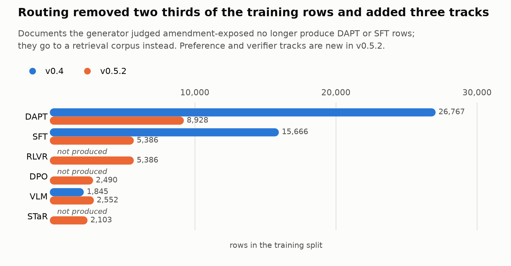
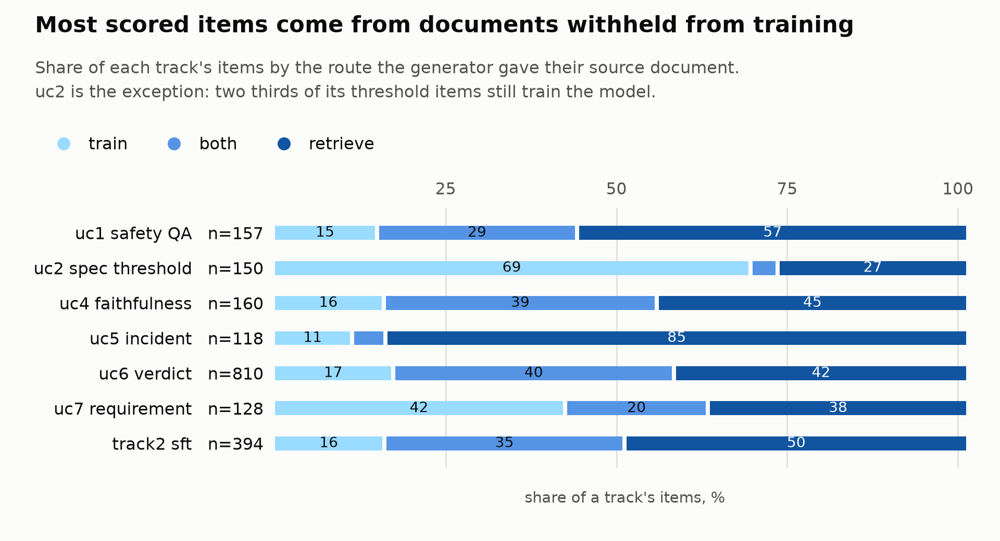
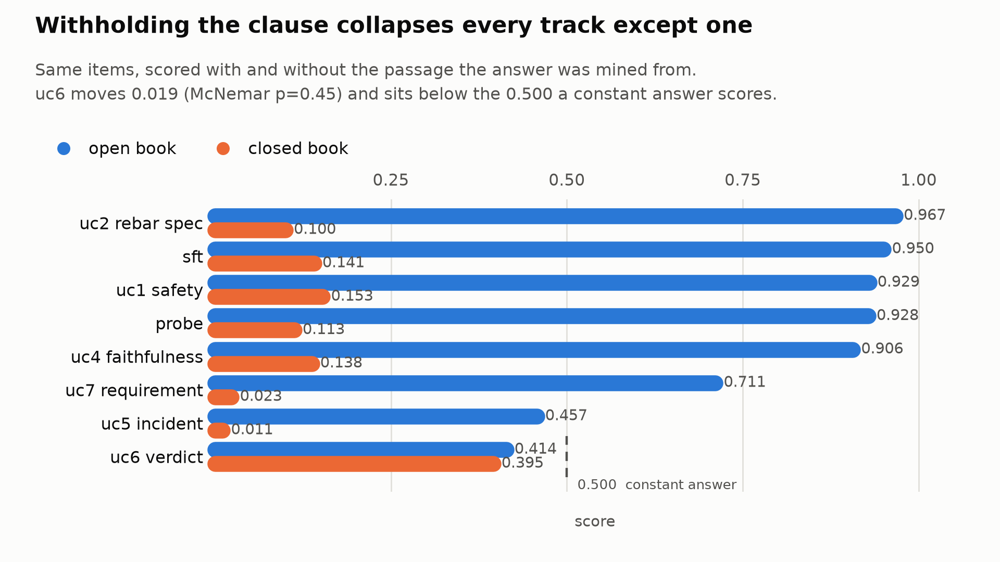
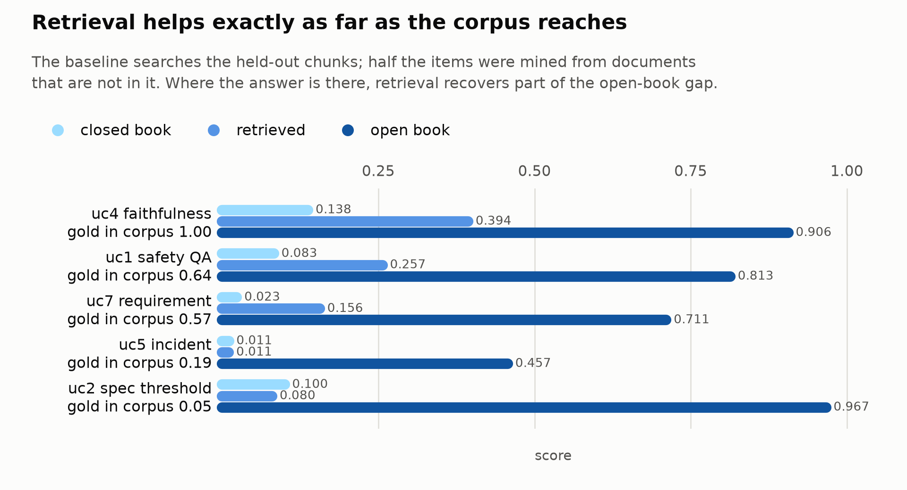
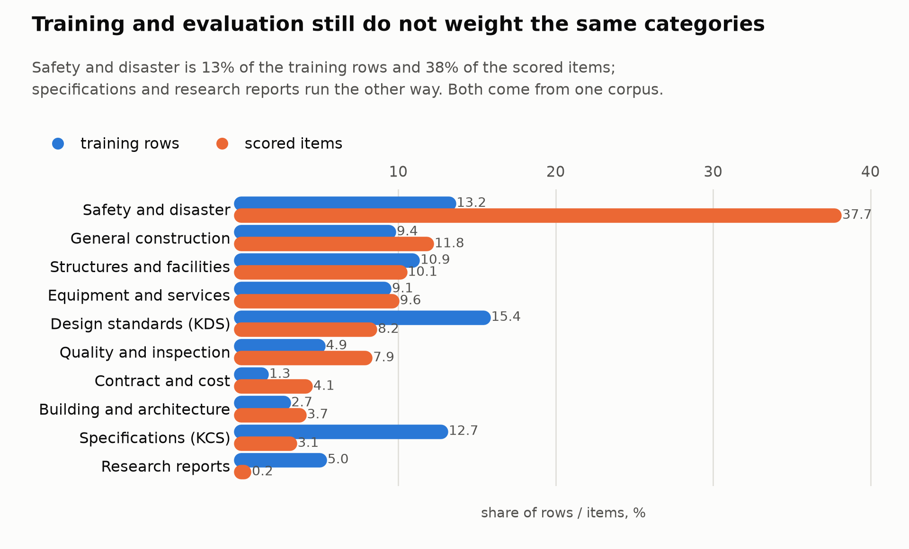

# Worked example-2: Korean construction corpus (advanced)

The corpus, the holdout and the item set are the ones
[worked example 1](worked-example.md) describes. What changed is the generator:
[gen_aec_syn_data](https://github.com/mac999/gen_aec_syn_data) v0.5.2 routes each
source document to training, to a retrieval corpus, or to both, and emits four
training formats the earlier release did not. This page reports what that
changed, and two measurement defects the comparison exposed in the benchmark
itself.

Generation ran 12 h 15 min over 1,957 documents on one GB10. The benchmark was
rebuilt with `--skip-holdout` so the held-out set is the one v0.4 used.

## What this comparison can and cannot show

The evaluation items are **identical**. Every item in uc1, uc2, uc4, uc5, uc6 and
uc7 carries the same id in both builds; track1 and track2 are subsets
(5,320 of 5,381 and 394 of 395). That follows from reusing the holdout, and it
means v0.5.2 changes what a model would be **trained on**, not what it is asked.

So this is not a measurement of one dataset against another. Establishing that
would require fine-tuning on each and scoring the results, which is a separate
exercise. What is reported here is the composition change, an audit of the new
tracks, and a re-scored baseline — the earlier runs predate several grader
corrections and are not comparable to these.

`cb.py verify` passes 5,724 items on all four checks (source exists, source
matches, in holdout, absent from train).

## Document routing changed the training split, not the questions

The generator scores each document for amendment exposure and routes on that
score: below the threshold to training, above it to a retrieval corpus, and a
band in between to both. On this corpus that is 235 documents to `train`, 609 to
`both` and 1,103 to `retrieve`.

<picture>
  <source media="(prefers-color-scheme: dark)" srcset="split-composition-dark.png">
  
</picture>

| Track | v0.4 | v0.5.2 |
|---|---:|---:|
| DAPT | 26,767 | 8,928 |
| SFT | 15,666 | 5,386 |
| VLM | 1,845 | 2,552 |
| STaR | — | 2,103 |
| DPO | — | 2,490 |
| RLVR | — | 5,386 |

Before holdout filtering the generator wrote 11,652 DAPT records against 32,964
in v0.4, and 22,347 retrieval chunks where v0.4 wrote none. The file counts match
the routing exactly: 844 folders hold a DAPT file (235 `train` + 609 `both`) and
1,712 hold a retrieval file (609 `both` + 1,103 `retrieve`).

The scored items are mined from held-out documents, which are routed by the same
rule, so the routing label travels with them:

<picture>
  <source media="(prefers-color-scheme: dark)" srcset="routing-mix-dark.png">
  
</picture>

## The generator's router and the benchmark's classifier do not measure the same thing

`cb.py volatility` labels an item `volatile` when its answer is a figure a
revision moves. The generator labels a *document* amendment-exposed. Joined on
chunk digest, the two agree on 89.4 % of items and Cohen's kappa is **0.016**.

The agreement is base rate. Four items in five are volatile under both, and with
marginals that skewed a high raw figure carries almost no information. The
signals explain why they are not interchangeable:

| | Signals | Unit |
|---|---|---|
| Generator | document title and metadata — amendment, issue number, form, notice, effective date | document |
| Benchmark | item content — regulated figure, qualifier, requirement phrasing, table clause | item |

Two terms are used on purpose: **amendment-exposed** is the generator's
document-level label, **volatile** is the benchmark's item-level label. They
are kept distinct precisely because the kappa above says they are not the same
property.

They are separate cuts, so scores are reported against each axis separately
rather than one being used to validate the other. The generator's label is also a
document property (1,699 folders uniform, 13 mixed), so items from one document
share it and the effective sample is smaller than the item count.

**The benchmark's volatility rules are not validated by this.** They remain a
rule set whose agreement with an independent labeller is at chance once base rate
is removed.

## New tracks

| Track | Rows | Audit |
|---|---:|---|
| STaR | 2,103 | no empty answers; 2,096 carry evidence; 3,856 accepted of 10,031 generated (38.4 %) |
| DPO | 2,490 | no degenerate pairs (`chosen` never equals `rejected`, none empty); three rejection kinds |
| RLVR | 5,386 | rule rewards, four verifier types, no missing reference answer |

The DPO pairs differ in length by a median of **3 characters**. Length is a known
shortcut in preference training — a model can learn "longer is preferred" instead
of the intended distinction — and these pairs do not offer it.

## Re-scored baseline

qwen3:8b, greedy, thinking disabled. Judge panel for prose answers is
exaone3.5:7.8b, glm4:9b and gemma2:9b: three lineages, none shared with the model
under test, so a majority is not unanimity.

<picture>
  <source media="(prefers-color-scheme: dark)" srcset="open-vs-closed-v052-dark.png">
  
</picture>

| Track | n | Open | Closed | Change |
|---|---:|---:|---:|---:|
| uc2 rebar spec | 150 | 0.9667 | 0.1000 | −0.8667 |
| sft | 394 | 0.9500 | 0.1406 | −0.8094 |
| uc1 safety | 157 | 0.9294 | 0.1529 | −0.7765 |
| probe | 400 | 0.9281 | 0.1125 | −0.8156 |
| uc4 faithfulness | 160 | 0.9062 | 0.1375 | −0.7687 |
| uc7 requirement | 128 | 0.7109 | 0.0234 | −0.6875 |
| uc5 incident | 118 | 0.4572 | 0.0107 | −0.4465 |
| uc6 verdict | 810 | 0.4136 | 0.3951 | −0.0185 |

Against the August runs, which used the earlier graders, the movement is
confined to one answer type:

| Track | Type | v0.4 | v0.5.2 | Change |
|---|---|---:|---:|---:|
| uc1 safety | nameset | 0.4726 | 0.6764 | **+0.2038** |
| sft | nameset | 0.5869 | 0.7330 | **+0.1461** |
| uc5 incident | nameset | 0.4683 | 0.4572 | −0.0111 |
| sft | numeric | 0.9437 | 0.9500 | +0.0063 |
| uc1 safety | numeric | 0.9412 | 0.9294 | −0.0118 |
| uc2 rebar spec | numeric | 0.9667 | 0.9667 | 0.0000 |
| uc4 faithfulness | faithfulness | 0.9125 | 0.9062 | −0.0063 |

The two large moves are the nameset match-mode correction: uc1 and track2 keyed
prose answers but were graded with exact match, while uc5 was already fuzzy and
does not move. The numeric grader was also corrected — it took the first number
in the reply, which on prose answers was often a list marker, and now locates
the figure by its unit — but on these tracks that change is **not measurable**.
Nothing here is attributable to the v0.5.2 data; the items are the same.

### Both axes are confounded with answer type

Read marginally, volatility appears to separate: `stable` 0.395, `unknown` 0.659,
`volatile` 0.711. But all 45 `stable` items are namesets and no other answer type
has any, so the difference is nameset against numeric.

Route is worse — controlling for answer type reverses it.

| Answer type | train | both | retrieve |
|---|---|---|---|
| faithfulness | 25 / 0.840 | 63 / 0.889 | 72 / 0.944 |
| nameset | 34 / 0.659 | 30 / 0.668 | 280 / 0.576 |
| numeric | 232 / 0.957 | 222 / 0.928 | 421 / 0.943 |
| sentence | 54 / 0.685 | 26 / 0.692 | 48 / 0.750 |
| verdict | 138 / 0.355 | 328 / 0.396 | 344 / 0.445 |

Marginally `train` leads `retrieve` 0.740 to 0.688; within answer type `retrieve`
is higher in three of five. The marginal ordering is composition: `train` is 48 %
numeric, the easiest type, while `retrieve` is 30 % verdict, the hardest. Any
claim about routing has to be made inside an answer type.

## uc6 does not measure whether the model read the clause

Withholding the passage costs every other track between 0.45 and 0.87. It costs
uc6 0.0185. On the 810 paired items McNemar gives **chi-squared 0.565, p = 0.452**
— 181 items flip one way, 166 the other. The intervals overlap.

The model is not ignoring the passage. Its answer distribution shifts with it
(`contradict` 55 % open against 47 % closed, `entail` 15 % against 29 %). The
shift does not improve accuracy, which is the finding: the threshold comparison
the item asks for is not being performed.

Both conditions fall below the constant classifier. uc6 keys 405 `entail` and
405 `contradict`, so answering one label every time scores 0.500.

| | contradict | entail | Overall |
|---|---:|---:|---:|
| Open | 0.598 | 0.230 | 0.414 |
| Closed | 0.486 | 0.304 | 0.395 |

Two causes are separable. The reply schema offers `neutral` and `null`, which the
answer key never uses, and the model returns one of them on 33 % of open-book
items — always wrong. Among the items where it does commit, accuracy is 0.614,
above chance. The remainder is class bias.

uc6 is 810 of 2,317 scored text items, so this depresses any aggregate that
includes it. It is a property of the track as built in v0.4, not of v0.5.2 data,
and only the open-against-closed contrast exposes it.

### Two grader defects this surfaced

**A metric that could not be non-zero.** `evidence_hit` read 0.0000 on all 810
items. The key is the document title; the instruction asks for a clause id; the
model is shown only the clause text and cannot produce the title. The column is
now emitted only where the keyed evidence appears in the passage the model saw —
12 of 810 items — and omitted elsewhere.

**A missing metric counted as zero.** `_mean_scores` filled an absent score with
0.0, so "not measurable here" averaged in as "scored zero". It now averages over
the items that carry a metric and records the denominator.

Both are fixed; the runs above use the corrected graders.

## Image tracks needed their own run, and a guard to say so

uc3 and track3 send a rendered view with the question. Scored with the text
model the rest of the benchmark uses, every item returns HTTP 400. On uc3 that
is twenty consecutive failures and the run aborts, discarding the seven tracks
already scored. On track3 — ten items — it stays under the abort threshold and
records a clean zero that reads like a result.

The benchmark now asks the server what the model can do before sending a
picture, and skips the track with the reason recorded in the run file rather
than scoring it. Run separately against qwen3-vl:30b:

| Track | n | Score | Baseline |
|---|---:|---:|---:|
| uc3 bim site | 39 | 0.590 `correct` | 0.385 majority class |
| track3 mapping | 4 | 0.308 `key_f1` | — |
| track3 nameset | 6 | 0.692 `f1` | — |

uc3 is 0.21 above the majority class. Under the previous behaviour track3 was
reported at 0.000, which was the 400 rate rather than a score.

## The sentence metric needs a judge panel, not similarity

uc7 keys a requirement sentence lifted verbatim from the clause and grades it on
five axes. Comparing the two conditions shows what the panel contributes.

| | semantic | figure | covered | supported | grounded | judge agreement |
|---|---:|---:|---:|---:|---:|---:|
| Open | 0.8320 | 0.8828 | 0.7969 | 0.7812 | 0.7109 | 0.918 |
| Closed | 0.6538 | 0.0469 | 0.0703 | 0.0547 | 0.0234 | 0.974 |

Closed book, embedding similarity reports 0.654 while the proportion of answers
that actually state the requirement is 0.023. A similarity-only metric would have
overstated closed-book performance by a factor of 28. The model produces sentences
about the right subject that do not state the requirement, which is precisely the
failure a keyword or embedding score cannot see.

Judge agreement rises from 0.918 to 0.974: judges converge more readily when an
answer is clearly wrong.

Decomposing the 37 open-book failures afterwards showed the key set, not the
model, setting most of the ceiling: eleven items keyed a subject the clause
states more than one requirement about (the model gave the clause's other true
answer), six keyed a sentence carrying a second obligation the question never
asked (a correct answer to the asked one fails `covered`), and three failed
only the figure conjunct on a number belonging to a neighbouring
sub-requirement. The remined track is `uc7_requirement_v2` — 116 items after
the stricter admission — and `grounded` is now `covered` ∧ `supported` with
`figure` reported beside it, so the table above, scored under the old
three-way conjunction, reads stricter than a rerun will. The ~18 genuinely
model-side failures are answer-form errors, dropped subjects mostly, which is
the open-book handling SFT already moved (0.875 → 0.988 on uc4).

## Domain perplexity is unchanged

`cb.py ppl` over the held-out chunks with Qwen/Qwen3-8B gives **7.5677**
token-weighted (median chunk 7.7534) against 7.5887 for v0.4. The track is
5,320 chunks against 5,381 and they are nearly the same text, so this is the
control it should be: the corpus a base model is measured against did not move.

## Retrieval measures the corpus, not the retriever

`cb.py rag` embeds the held-out chunks, retrieves ten per question and answers
from those. Scored that way the five text tracks it covers average 0.1915 —
barely above closed book at 0.1966 and far below open book. Read as a retrieval
result that is wrong, and the reason is in the corpus rather than the retriever.

The corpus is `track1_dapt.jsonl`, the held-out chunks. Items are mined from
both sides of the contamination line. **For half of them the chunk the answer
came from is not in the corpus at all**, so no retriever could return it.

| Track | gold in corpus | recall@10 | recall given present |
|---|---:|---:|---:|
| uc4 faithfulness | 1.000 | 0.356 | 0.356 |
| uc1 safety | 0.637 | 0.197 | 0.310 |
| uc7 requirement | 0.570 | 0.258 | 0.452 |
| uc5 incident | 0.186 | 0.068 | 0.364 |
| uc2 rebar spec | 0.047 | 0.013 | 0.286 |
| **all** | **0.508** | 0.191 | **0.362** |

uc2's raw recall of 0.013 cannot exceed 0.047. Conditioned on the chunk being
present, the retriever finds it 29–45 % of the time at k=10 on every track —
a consistent figure the raw column hides.

The scores follow coverage, not the track:

<picture>
  <source media="(prefers-color-scheme: dark)" srcset="rag-coverage-dark.png">
  
</picture>

| Track | gold in corpus | Closed | Retrieved | Open | Gap recovered |
|---|---:|---:|---:|---:|---:|
| uc4 faithfulness | 1.000 | 0.1375 | 0.3937 | 0.9062 | 33 % |
| uc1 safety | 0.637 | 0.0828 | 0.2566 | 0.8134 | 24 % |
| uc7 requirement | 0.570 | 0.0234 | 0.1562 | 0.7109 | 19 % |
| uc5 incident | 0.186 | 0.0107 | 0.0105 | 0.4572 | 0 % |
| uc2 rebar spec | 0.047 | 0.1000 | 0.0800 | 0.9667 | negative |

Where the answer is in the corpus, retrieval recovers a fifth to a third of the
distance between closed and open book. Where it is not, retrieval adds nothing
and slightly hurts — ten irrelevant passages are worse than none.

This is a property of the baseline as configured, not of v0.5.2. It is visible
now because routing labels every item with the route of its source document.
v0.5.2 also produces a 22,347-chunk retrieval corpus covering the `both` and
`retrieve` documents, which is the corpus a deployment would actually search;
pointing the baseline at it is a design change for the next revision, recorded
in [todo.md](../todo.md).

uc6 was sampled rather than run in full under retrieval — 150 items instead of
810, on the expectation that a track which does not respond to the gold clause
would not respond to a retrieved one. **The sample refuted that.**

| Condition | uc6 score | abstained | off_vocab |
|---|---:|---:|---:|
| Open book | 0.4136 | 0.257 | 0.078 |
| Closed book | 0.3951 | 0.221 | 0.020 |
| Retrieved (150) | **0.2400** | **0.393** | 0.147 |

Retrieval does not leave uc6 unchanged, it makes it worse — 0.155 below closed
book. recall@10 on this track is 0.0: not one gold chunk was returned in 150
questions. Ten unrelated passages push the model into abstaining on 39 % of
items. This is the same effect uc5 and uc2 show at low coverage, at its
strongest. Running the sample was worth it; the inference was wrong.

## Repairing uc6

The three defects above are in how the item was written, not in what it asks,
so they are repairable. `uc6_verdict_v2` rebuilds the same 810 thresholds with
the subject named in the question, the reply schema offering only the two
verdicts the key uses, and the evidence field asked for only where a clause id
exists to key it against. The original track is kept beside it so the effect is
measurable.

| Items | qwen3:8b | llama3.3:70b |
|---|---:|---:|
| Original | 0.3960 | 0.5320 |
| Repaired | **0.6600** | **0.6200** |
| Change | **+0.264** (p < 0.0001) | **+0.088** (p = 0.016) |

Scored on the same 250 items for both models; over all 810, qwen3:8b goes from
0.4136 to 0.6840.

Two things follow. **The original track was defective rather than difficult**:
a 70B model scored 0.5320 on it, which is the constant answer plus noise. And
**what it measured was not competence**. On the original items the two models
differ significantly (p = 0.0017, the larger one ahead); on the repaired items
that difference disappears (p = 0.337). The gap was abstention — the smaller
model took the schema's unkeyed escape on 25.7 % of items against the larger
one's 5.6 %, and after the repair both fall to 10.1 % and 1.6 %.

Naming the subject could have made the items easier by restating the answer.
It does not: the limit appears in 6 of 810 subjects (0.7 %, all coincidental
digits such as the 2 in "2급") and the qualifier in none. Subject length is a
median of 9 characters.

Everything here is a config entry — `name_subject`, `verdicts_offered`,
`ask_evidence` — so the same repair applies to a verdict track built from
another corpus.

## What the corpus produced, by category

The seven formats are not drawn evenly from the corpus, and the reason is the
document type. A design standard is long and yields many chunks but few
extractable question-answer pairs; a safety notice is short and yields the
reverse.

| Category | DAPT | SFT | rag | STaR | DPO | RLVR | routed to retrieve |
|---|---:|---:|---:|---:|---:|---:|---:|
| Design standards (KDS) | 2,952 | 802 | 1,157 | 373 | 361 | 802 | 32 % |
| Specifications (KCS) | 2,865 | 230 | 1,162 | 105 | 86 | 230 | 22 % |
| Safety and disaster | 1,130 | 2,091 | 2,853 | 827 | 1,091 | 2,091 | 49 % |
| Structures and facilities | 858 | 1,793 | 4,016 | 690 | 782 | 1,793 | 63 % |
| Equipment and services | 1,006 | 1,202 | 4,134 | 460 | 522 | 1,202 | 47 % |
| General construction | 782 | 1,508 | 3,416 | 529 | 708 | 1,508 | 63 % |
| Quality and inspection | 362 | 826 | 1,737 | 330 | 410 | 826 | 57 % |
| Building and architecture | 196 | 450 | 1,078 | 141 | 205 | 450 | 65 % |
| Research reports | 1,067 | 150 | 0 | 63 | 60 | 150 | 0 % |
| Contract and cost | 139 | 177 | 2,113 | 92 | 88 | 177 | 80 % |
| Other construction | 194 | 582 | 299 | 150 | 201 | 582 | 38 % |
| Environment and energy | 95 | 202 | 323 | 87 | 115 | 202 | 48 % |
| BIM and smart construction | 6 | 18 | 59 | 9 | 2 | 18 | 67 % |
| BIM models (IFC) | — | — | — | — | — | — | VLM 2,672 |
| **Total** | **11,652** | **10,031** | **22,347** | **3,856** | **4,631** | **10,031** | |

Three shapes are visible. KDS and KCS carry 50 % of the DAPT chunks and 10 % of
the SFT pairs — bulk text, few keyable facts, and the lowest retrieve rates
(32 %, 22 %) because a standard's title does not announce amendments the way a
notice does. Contract and cost is the opposite: 139 DAPT rows against 2,113
retrieval chunks and an 80 % retrieve rate, so almost none of it trains the
model. Research reports route entirely to training — long documents with no
amendment markers — and BIM and smart construction is effectively absent at 6
DAPT rows.

### Training and evaluation weight different categories

Worked example-1 drew this chart counting SFT instruction pairs alone, because
SFT was the only keyed training format it had. This one counts the rows of
every training format — DAPT chunks, SFT pairs, STaR, DPO and RLVR records —
which is why the axis says rows where example-1 said pairs. The finding is the
same in both.

<picture>
  <source media="(prefers-color-scheme: dark)" srcset="catdist-v052-dark.png">
  
</picture>

| Category | training rows | scored items | n | open | closed | rag |
|---|---:|---:|---:|---:|---:|---:|
| Safety and disaster | 13.2 % | 37.7 % | 891 | 0.632 | 0.200 | 0.186 |
| General construction | 9.4 % | 11.8 % | 280 | 0.661 | 0.254 | 0.310 |
| Structures and facilities | 10.9 % | 10.1 % | 240 | 0.758 | 0.212 | 0.357 |
| Equipment and services | 9.1 % | 9.6 % | 227 | 0.648 | 0.159 | 0.333 |
| Design standards (KDS) | 15.4 % | 8.2 % | 194 | 0.879 | 0.088 | 0.084 |
| Quality and inspection | 4.9 % | 7.9 % | 186 | 0.716 | 0.204 | 0.441 |
| Contract and cost | 1.3 % | 4.1 % | 98 | 0.725 | 0.214 | 0.267 |
| Building and architecture | 2.7 % | 3.7 % | 87 | 0.642 | 0.287 | 0.545 |
| Specifications (KCS) | 12.7 % | 3.1 % | 74 | 0.878 | 0.135 | 0.018 |
| Environment and energy | 1.2 % | 1.1 % | 27 | 0.581 | 0.296 | 0.333 |
| BIM models (IFC) | 8.0 % | 2.1 % | 49 | 0.574 | — | — |
| Research reports | 5.0 % | 0.2 % | 4 | 1.000 | 0.000 | — |

The mismatch matters for how the aggregate reads. Safety and disaster is 38 %
of the scored items and scores 0.632 open book, below the 0.690 overall;
KDS and KCS score 0.879 and 0.878 but are 11 % of the item set between them.
A single headline number is mostly a statement about safety and disaster.

The two shares are not independent knobs — both come from one corpus by one
set of rules, and a document that yields many chunks does not thereby yield
many keyable items. Reading a per-category row is more informative than the
aggregate, which is why the run files carry the breakdown.

## Limits

- One model, one decoding setting. Nothing here separates models.
- The volatility rule set is unvalidated. Its agreement with the generator's
  independent router is at chance after base rate.
- uc6 as originally built does not discriminate and must be read against 0.500,
  not 0. `uc6_verdict_v2` does; the two are not comparable with each other.
- The 70B figures are 250 items, the first of the file rather than a random
  draw.
- Category rows with fewer than 30 items (research reports, BIM and smart
  construction) are reported for completeness, not as measurements.
- `evidence_hit` is measurable on 12 uc6 items. Reporting it as a track-level
  number is not meaningful until the key names something the model is shown.
- The generator's route is a document property, so items from one document are
  not independent observations of it.
- The retrieval baseline searches a corpus that holds the answer for half the
  items. Its scores are a lower bound on what retrieval over the full corpus
  would give.
