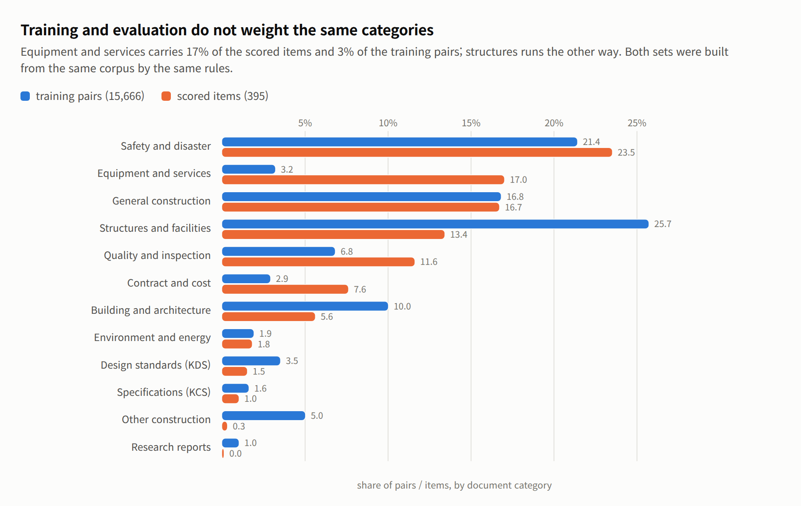

# Worked example: a Korean construction corpus

The full campaign. The headlines are summarised in
[the README](../README.md#worked-example-a-korean-construction-corpus); this is
everything behind them.

How a run of this benchmark reads, from the project it was built for: Qwen3-8B
fine-tuned in two stages — domain-adaptive pre-training over 26,767 raw chunks,
then supervised fine-tuning over 15,666 instruction pairs. Read top to bottom,
the charts are the argument for the benchmark. Every metric named below —
numeric accuracy, nameset F1, perplexity, ECE, McNemar — is defined, with its
source, in [metrics.md](metrics.md).

**What this example was for.** The metrics below were not chosen because they
are the right way to judge DAPT or SFT. They were run to find out *which
metrics register a difference at all* when the training data changes — the
campaign is an experiment on the instrument as much as on the model. Several of
them turned out not to move: closed-book recall was flat across four recipes,
and reporting it as "the fine-tuning result" would say more about the metric's
sensitivity than about the training.

**And a warning about what to conclude.** Read task by task, retrieval beat
fine-tuning here by a wide margin, and it will keep doing so for a large class
of construction work. Clause text, dimensional thresholds, specification limits
— anything that is *written down somewhere and revised periodically* — is
better looked up than memorised: retrieval moved accuracy from 0.147 to 0.481
on exactly those items while four rounds of training moved them 0.009, and a
revised standard costs a re-index rather than a retrain. Fine-tuning earned its
place on the other kind of task, the ones about *how* the model answers rather
than *what* it knows: output format, calibration, use of a clause once it has
been supplied. Anyone reading the numbers below as a verdict on fine-tuning in
general should first ask which of those two kinds their own task is.

**The training data behind these numbers.** The raw corpus is ~1 GB of Korean
construction documents — design standards (KDS), specifications (KCS), safety
and disaster regulation, quality and inspection, contract and cost, BIM and
smart construction, IFC building models, research reports — thirteen categories
in all, collected from public sources. It was turned into AI-ready training
data (chunked text, instruction pairs, VLM captions) with
[gen_aec_syn_data](https://github.com/mac999/gen_aec_syn_data), a synthetic-data
pipeline by the same author; the processed dataset is available on
[Google Drive](https://drive.google.com/drive/folders/1Cz7S-QhXRwQgsajDDyjBAC8vK30jQQTN?usp=drive_link).
kcbench then split that dataset — the held-out documents became the evaluation
tracks, the rest became `data/train/`, and every number below rests on that
split.

**Known limits of this example dataset, as of August 2026.** The corpus is
still being collected and these figures describe the snapshot the example ran
on, not the dataset's ceiling. Its weaknesses belong up front, because they
bound what the results below can be taken to mean.

**Scale is the first of them.** Stage 1 saw **3.7 million tokens**
of Korean construction regulation — 26,767 chunks from 865 documents — in a
single pass, and stage 2 trained on 15,666 instruction pairs. Continued
pre-training that successfully adds domain knowledge is normally reported at
billions of tokens with several passes over each fact; this is roughly three
orders of magnitude below that, and the adapter was LoRA rank 64, 174.6M
trainable parameters or 2.1% of an 8B model. **The campaign's central negative
result — that four data recipes moved closed-book recall not at all — is
therefore a statement about this corpus at this scale and this adapter size,
not about domain fine-tuning in general.** The augmentation turns rearranged
3.7M tokens; none of them added information the corpus did not already contain.
The larger-adapter test that would settle it has not been run: fine-tuning here
crashed with out-of-memory five times, but always at rank 64 and always while
the benchmark was scoring on the same unified-memory box, so what those crashes
measured was contention rather than adapter capacity. The arithmetic is in
[solution.md](../solution.md#the-memory-ceiling-and-what-it-does-not-prove).

**Scale is not the only explanation, and probably not the largest.** An audit of
the instruction pairs against the items they are scored on found three faults,
of which only the first is about size:

| Fault | Measured | Why it matters |
|---|---|---|
| **Scale** | 3.7M tokens, one pass | too few exposures per fact for recall to form |
| **Format mismatch** | 82% of training answers are prose; 81% of scored items ask for a bare figure | the model was never shown the task it is graded on. **More data does not fix this** |
| **Distribution mismatch** | equipment and services is 3.2% of training and 17.0% of the evaluation; structures is 25.7% against 13.4% | the categories weighted most heavily at scoring time are the thinnest in training |

The format mismatch is the sharpest of the three. Training answers wrap their
figures in sentences — *상수도설계기준의 재검토기한은 … 매 3년이 되는 시점* — while
the scored items instruct *"숫자와 단위만 답하시오"* and key on `5 년`. Across a
3,000-pair sample **no training instruction asks for a bare number at all**, so a
model holding the fact can still score zero for expressing it the way it was
taught to. That is a data-design fault rather than a capacity one, and it is
repairable with the corpus already in hand.

<picture>
  <source media="(prefers-color-scheme: dark)" srcset="catdist-dark.png">
  
</picture>

Safety, general construction and environment line up almost exactly, so the
split is not systematically skewed — the mismatch is concentrated in a few
categories. It arises because the two sets are built by different rules from the
same corpus: training pairs follow document volume, while scored items follow
how many clauses survive the miner's admission filter, and equipment
specifications yield far more admissible numeric thresholds per document than
structural design text does.

Three things the same audit found healthy, so they are not candidate
explanations: duplication is low (1.8% of questions, 3.5% of answers); answers
are reconstructed rather than copied out of the clause (7.0% appear verbatim);
and question types are spread reasonably (what 42%, how 15%, quantity 14%,
when 4%) rather than collapsing onto one form.

Three further limits shape specific numbers. Nearly all instruction pairs (95%)
carry the source clause in the prompt and answer in a median of 56 characters —
generated for RAG-style use, so they teach extraction and brevity, and stage 2
shows exactly that signature. The corpus collects the same regulation more than
once, under names differing by a suffix and as amendment pairs, so splitting by
document name would have leaked 759 held-out chunks into training, which is why
the split works by content digest. And of its 93 IFC building models, 57 are
parser regression fixtures holding one or two elements each; after exclusions
only 12 carry enough geometry to ask about, which is why the `vlm` track is 10
items and reads as a smoke test rather than a measurement.

> **Before reading these results as a verdict on fine-tuning, size your own run
> against them.** If closed-book domain knowledge is your goal, budget the
> pre-training corpus in billions of tokens rather than millions, plan several
> passes over each fact, and give the adapter enough capacity to store what you
> are asking it to learn — or fine-tune the full weights. If your corpus is the
> size of this one, the honest expectation is what this campaign measured:
> better handling of text you supply at inference, and no new knowledge in the
> weights. That is a perfectly useful outcome for a RAG system, and a poor one
> if you needed the model to answer from memory. The benchmark will tell you
> which you got; it cannot make a small corpus behave like a large one.

## Scoring protocol — the three prompt conditions

Every number below comes from one of three prompt shapes. Every checkpoint,
including the untrained base, is scored on the same frozen items in all three,
which is what makes the result columns comparable — the training recipes differ,
the tests do not.

| Scoring mode | Prompt shape | What it measures |
|---|---|---|
| **open book** | the clause is supplied, as a RAG system would at runtime | reading comprehension |
| **closed book** | no clause; the document is named instead — *「KDS 14 20 50」에 따르면, …* | domain knowledge held in the weights |
| **`uc4`** | a clause is supplied but swapped for one that does not answer the question, paired 1:1 with unmodified controls so that blanket refusal scores 0.5 | refusing without support |

Open book is near its ceiling on any competent model, so it cannot separate a
fine-tune from its base; closed book is where domain training has something to
add. Both are graded against the same answer key.

<picture>
  <source media="(prefers-color-scheme: dark)" srcset="closed-vs-open-dark.png">
  
</picture>

**Start here: is this corpus even worth training on?** Six models that never saw
it, scored on `sft` numeric accuracy. Hand them the clause and they answer
correctly 85–95% of the time — they read Korean regulation fluently. Take the
clause away and none of them clears 17% — they have not memorised any of it.
That gap is the room fine-tuning has to work in.

<picture>
  <source media="(prefers-color-scheme: dark)" srcset="uc-baseline-dark.png">
  
</picture>

**The same gap holds on the agent's own tasks.** The use-case tracks mirror the
five jobs the fine-tuned agent is being built for — safety lookups, rebar
specification checks, incident analysis. The chart covers three of them, split
by answer type rather than by track, because a numeric accuracy and a nameset
F1 are different measurements and one bar averaging them would hide which moved:
numeric accuracy runs 95% open book against 9–16% closed, nameset F1 53–66%
against 0–2%. The open-book numbers are what matter for the deployed system,
since retrieval will supply the clause; the closed-book floor is what
fine-tuning is trying to raise.

Two things to know before reading the closed-book bars. uc2 and uc5 draw most of
their items from training-side documents — 143 of 150 and 96 of 118 — so their
closed-book figures are probe-style diagnostics, not held-out measurements; run
files break both out under `by_split`. And the two use cases missing from the
chart are missing for a reason: uc3 is a vision task with no clause to withhold,
and uc4 is scored on abstention, which belongs on its own axis.

**uc4 is the exception worth naming.** Given a swapped, unrelated clause, the
base model correctly abstains 95% of the time — refusing to invent is one thing
it already does well. That number is an abstention rate rather than one of the
accuracy bars above, and it is an open-book measurement: withholding the passage
from an item whose whole question is whether the passage supports an answer
would leave nothing to be faithful to.

<picture>
  <source media="(prefers-color-scheme: dark)" srcset="dapt-perplexity-dark.png">
  
</picture>

**Did training move anything?** Perplexity on 5,381 held-out chunks fell 40%,
7.589 → 4.553, in every one of the thirteen categories. The two that stayed
highest — research reports, uncategorised documents — are the two least like the
regulation prose the corpus is mostly made of, which is the answer you would
expect if the model were learning the domain rather than the dataset.

<picture>
  <source media="(prefers-color-scheme: dark)" srcset="dapt-loss-dark.png">
  
</picture>

**The training run itself was uneventful.** Loss fell from 2.091 to 1.452 over
836 steps and the curve has nothing odd in it. Worth showing precisely because
of the next chart: a clean loss curve and a 40% perplexity drop are not evidence
that the model got better at its job.

<picture>
  <source media="(prefers-color-scheme: dark)" srcset="probe-regression-dark.png">
  
</picture>

**This is the measurement the other three cannot give you.** Asked questions
whose answers sit in the documents it just trained on, the fine-tuned checkpoint
answered fewer of them than the base model it started from — numeric accuracy,
closed book, over the probe's 320 numeric items — while perplexity on the same
corpus had just improved 40%. No other track here could have shown that.

The first reading of the gap was wrong, and the correction is the more useful
result. It looked like continued pre-training had destroyed the model's ability
to follow an instruction: 2.9% correct, and 43% of replies containing no answer
at all. The checkpoint had been registered with Ollama under a pass-through
template and no stop tokens, so it was prompted without the chat markers the
base model got and was never told where to stop. Served the way its base is
served, the same weights answer 11.4% and fall silent on 28% — most of the
collapse was the harness.

Most, not all. 11.4% against a base of 16.9%, and 28% silence against none, is
still a real regression: stage 1 did cost this checkpoint some of its ability to
answer, which is what stage 2 exists to restore. Both readings were wrong in
the same direction — the first overstated the damage, and the impulse to call
the whole thing a harness bug would understate it.

Two things worth keeping from that. A benchmark comparing two checkpoints has to
serve them identically, and nothing in the scoring code checks that. And a
result that looks like a dramatic model failure deserves to be suspected of
being a harness failure first — this one was caught because the symptom, every
reply running to the generation limit, was too uniform to be a property of a
model.

<picture>
  <source media="(prefers-color-scheme: dark)" srcset="stage2-scored-dark.png">
  
</picture>

**And the verdict, after stage 2.** With the format damage repaired and both
models decoded identically, the fine-tuned checkpoint scores within noise of
its base on both tracks — McNemar p = 0.89 on the probe, 0.78 on `sft`. Both
are numeric accuracy, closed book, over the 320 numeric items each track
carries. Of those 320 probe items the fine-tune gained 26 and lost 24: churn,
not learning. The training pipeline restored what stage 1 had broken and added
no measurable closed-book knowledge, and the loss curves alone — 2.09 → 1.45,
then 0.33 → 0.11, both textbook — would never have said so. That is the
benchmark's case in one pair of bars: every other signal reported success.

<picture>
  <source media="(prefers-color-scheme: dark)" srcset="sft-loss-dark.png">
  
</picture>

**The stage 2 run itself, for the record.** Two epochs, healthy curve, no
anomalies. Its absolute values are not comparable to the stage 1 curve — SFT
masks the prompt and scores only the answer tokens, an easier objective. A
clean curve and a null result are the same story told twice: nothing about
training dynamics says whether anything was learned.

**The rest of the picture, from the remaining tracks.** Scored the same way,
the fine-tune is not uniformly a null result. Its calibration improved
dramatically: expected calibration error over the same 320 numeric items
halved, 0.641 → 0.320 (Brier 0.554 → 0.226) — the base model repeats the same
wrong number at 78% self-consistency, while the fine-tune's samples disagree
when it does not know. On the agent's use-case tracks, the faithfulness
behaviour survived training (abstention on swapped clauses 0.95 → 0.93, and
accuracy on unmodified controls improved 0.875 → 0.938), and incident analysis
improved significantly (uc5 nameset F1 +0.096 [+0.03, +0.17], fuzzy matching)
while safety-list enumeration regressed the same way `sft` did (uc1 nameset F1
−0.148 [−0.24, −0.06], exact matching — the two F1s are not scored by the same
matcher). And the self-check validation earned its keep by failing honestly:
sampling consistency separates wrong answers from right ones by 0.026 —
nothing — because 61% of this model's wrong answers are *consistently* wrong,
which is the same confident-hallucination behaviour
the calibration number measures. A hallucination detector that assumes invented
facts vary across samples does not work on a model that invents them stably.

That is the whole argument for building a benchmark this way. Perplexity said
the training worked. The probe set said what it had cost. You need both numbers,
on frozen items, before and after, or you are guessing.

## Training stages — data, metric and outcome per stage

A domain model is usually built in stages — continued pre-training, supervised
fine-tuning, preference alignment, retrieval — and each stage consumes a
different kind of data and moves a different metric. Pointing the wrong metric
at a stage is how a run gets called successful when nothing useful changed: this
campaign had clean loss curves and a 40% perplexity improvement while closed-book
knowledge stayed flat.

The table gives each stage's data shape, the tracks that can detect it, and what
this corpus produced — Qwen3-8B, 3.7M tokens, LoRA rank 64.

| Stage | Training data | Measured by | Result on this corpus |
|---|---|---|---|
| **DAPT** — continued pre-training | raw chunks, no labels | `dapt` perplexity | **7.589 → 4.553, −40%**, all 13 categories |
| **SFT** — supervised fine-tuning | instruction/answer pairs | `sft`/`probe` closed book; `sft` open book; `uc5` | knowledge **+0.009 (noise)**; supported-clause use **0.875 → 0.988**; prose **0.468 → 0.565** |
| **DPO** — preference alignment | chosen/rejected answer pairs | `uc4` abstention; ECE | **not run** — see below |
| **RAG** — retrieval at inference | no training; an embedder and an index | `cb.py rag`, recall@k | **0.147 → 0.481**, recall@10 0.400 |
| (any stage) | — | ECE, calibration | **0.641 → 0.281** across the SFT rounds |

#### Training data by stage

**DAPT — raw text, no questions.** Chunked regulation as written. The objective
is next-token prediction, so nothing is labelled.

> `상수도설계기준 제1조(목적) 이 고시는 「수도법」제18조제1항, 「건설기술 진흥법」 제44조제1항에 따라 …`

26,767 chunks, 3.7M tokens. Perplexity fell furthest on the documents least like
ordinary prose — specifications (KCS) 10.24 → 6.02 — which is the signature of
a model learning clause structure and terminology.

**SFT — instruction, context, answer.** Five pair shapes were tried across four
rounds, each teaching something measurably different; they are shown with real
examples under [the five kinds of pair](#pair-types-in-the-augmented-training-set) below.

**DPO — chosen and rejected pairs.** Not run in this campaign, so nothing here
is measured. What it would be measured on is worth stating anyway, because two
of the campaign's findings bear on it: `uc4` abstention and ECE are exactly the
behaviours preference alignment is normally used to shape, and both proved
**sensitive to training in the wrong direction** — refusal pairs added through
SFT drove abstention from 0.950 down to 0.688. Anyone reaching for DPO to fix
abstention should measure `uc4` before and after rather than assume it helps.

**RAG — no training data at all.** An embedder and an index over the same
corpus. The one decision that matters is which embedder: on this corpus,
English-centred models retrieved the source chunk 2% of the time at top-3 and
multilingual ones 24–31%, and end to end the difference was **0.144 against
0.481** — the first is what the model scores with no retrieval whatsoever.

#### Stage selection by target metric

| If the metric that matters is… | The stage that moves it | Evidence here |
|---|---|---|
| perplexity on domain text | **DAPT** | −40%, the campaign's largest single move |
| closed-book facts | **RAG**, not fine-tuning | +0.334 vs +0.009 across four recipes |
| complete enumeration | RAG first, then SFT | +0.318 from retrieval; enumeration pairs recovered half of an SFT-caused regression |
| output format, refusal to guess | **SFT** | blank replies 43% → 0% |
| confidence calibration | **SFT** | ECE 0.641 → 0.281 |
| abstention when unsupported | **none — preserve it** | base 0.950 was the best any checkpoint achieved |

The last row is the one that cost this project the most to learn. Abstention was
the only capability that got worse the more directly it was trained, and the
untrained base model held the highest score of all five checkpoints.

## Ablation: four training-data recipes

Four fine-tunes, each trained on the same corpus augmented a different way, to
find out which augmentation teaches what. Everything else is held constant —
same base model, same stage 1 adapter, same hyperparameters, same frozen
evaluation items — so a score difference is attributable to the training data
and nothing else. `v1` is the generated dataset as it came, and each later version adds
augmented pairs on top, produced by `training/augment_sft.py`.

| Version | Pairs | What was added | Total |
|---|---|---|---:|
| `v1` | the generated pairs, untouched | — | 15,666 |
| `v2` | + closed-book variants + enumeration pairs | strip the clause out of an existing pair; mine full lists out of the corpus | 22,249 |
| `v3` | + paraphrases + refusal pairs (easy) | restate each closed-book question several ways; swap in a clause from an *unrelated* document and make refusal the answer | 32,080 |
| `v4` | + refusal pairs (hard) | same, but the swapped clause comes from the *same* document | 32,005 |

## Pair types in the augmented training set

Each shape is checked by a different [scoring
condition](#scoring-protocol--the-three-prompt-conditions): type 1 by open book,
types 2–4 by closed book, type 5 by `uc4`.

Real examples from the v4 file, abridged. The first is what the dataset
generator produces; the other four are what the augmenter makes from it.

**1. Original — 15,666 pairs.** Question, clause, answer. The clause is in the
prompt, so this teaches extraction.

> **Q** 행정중심복합도시건설청 공무직 등 근로자 관리규정에서 채용담당부서가 해서는 안 되는 행위는?
> **조문** ① 채용담당부서는 특정 응시자에게 유리하도록 채용계획을 수립하거나, 공고내용을 변경하는 등 …
> **A** 특정 응시자에게 유리하도록 채용계획을 수립하거나, 공고내용을 변경하는 등 채용 공정성을 해치는 행위입니다.

**2. Closed-book variant — 5,910 pairs (v2 on).** The same question and answer
with the clause deleted, so answering requires memory rather than reading. The
instruction rotates through several phrasings so the skill is not welded to one.

> **Q** 소규모주택정비사업 중 '가로주택정비'는 어떤 조항에 포함되나요? *(조문 없음)*
> **A** … '3. 소규모주택정비사업(가로주택정비ㆍ자율주택정비ㆍ소규모재건축ㆍ소규모재개발) 관리에 관한 사항'에 포함됩니다.

**3. Paraphrase — 7,600 pairs (v3 on).** A local model rewrites each
closed-book question two ways; the answer is unchanged. A fact met in only one
wording tends to be stored but not retrievable, so each fact is asked several
ways.

> **Q** 하천보수원 채용 인사위원회 구성에 관련된 규정은 무엇인가요? **기억나는 대로 알려주세요.**
> **A** 인사위원회의 위원은 관리국장, 채용권자가 지명하는 3인 이상의 5급 이상 공무원으로 구성되며 …

**4. Enumeration — 892 pairs (v2 on).** Mined from clauses that introduce a
list, with every item as the answer. The generated pairs answer in a median of
56 characters, which taught brevity; these are the counterweight.

> **Q** 「철도안전관리체계 기술기준」에서 다음을 모두 나열하시오: … 필요한 기록을 …
> **A** 관리하여야 할 기록의 정의, 기록의 식별, 보관, 보호, 검색, 보유 및 폐기 등, 위험관리

**5. Refusal — 1,920 pairs (v3 on), 1,937 (v4).** The question keeps its own
wording but is given a clause that does not answer it, verified not to contain
the answer, and the target becomes a refusal. Refusal phrasing rotates. **This
is the only pair type that differs between v3 and v4**: v3 draws the swapped
clause from an unrelated document, v4 from the same document as the question,
so its vocabulary matches and refusing cannot be decided from topic alone.

> **Q** 민자도로 운영평가 결과를 민자도로사업자에게 통보하는 주무관청의 의무는 어떤 조항에?
> **조문** 제18조(지령실의 운영과 무선통신망의 운용절차) 지령실은 각 지구대 및 순찰차 … *(질문과 무관)*
> **A** 제시된 조문에서 관련 근거를 확인할 수 없습니다.

## Per-recipe results

The second turn — v2, the closed-book and enumeration pairs — answered all three
ways a turn of the loop can:

- **One fix validated.** The 637 enumeration pairs moved open-book nameset F1
  0.379 → 0.491 (+0.11, interval [+0.05, +0.18]), recovering more than half of
  the regression. The mechanism was the mechanism.
- **One fix refuted.** 5,946 closed-book variants moved probe recall not at
  all — 0.153 → 0.128, still level with the untrained base. Asking from memory
  once per fact does not put the fact into a rank-64 adapter; the
  knowledge-injection literature's prescription (many paraphrases per fact,
  more pre-training passes) is the next candidate, and it is a data-generation
  and budget question, not a mixing-ratio question.
- **One tradeoff surfaced.** Training the model to answer without a clause also
  taught it to answer when the clause does not support one: abstention on
  swapped clauses fell 0.925 → 0.750 (p = 0.0005), the first significant
  regression on the safety track across the whole example. A closed-book
  mixture needs abstention pairs alongside it, or it trades recall it does not
  gain for honesty it had.

The third turn tested the refined recipe — 7,692 LLM-generated paraphrases of
the closed-book questions and 1,920 refusal-target pairs — and both prescriptions
failed on their own metrics. Recall stayed at the base rate (0.156, p = 0.78),
which after three attempts closes the question: SFT-side augmentation does not
put facts into this adapter, and the remaining levers are on the pre-training
side — paraphrase-augmented DAPT text, more passes, or more adapter capacity.
Abstention stayed where v2 left it (0.750): the refusal pairs swapped in clauses
from unrelated documents, which are easy to recognise as unrelated, while the
faithfulness track swaps in plausible same-corpus clauses — a refusal trained on
easy negatives does not transfer to hard ones. Meanwhile calibration improved
for the third straight turn (ECE 0.641 → 0.281) and answering on supported
clauses reached 0.988, the best of any checkpoint.

All four checkpoints on the same frozen items, identical decoding
(`--think off`, temperature 0):

| Metric | base | v1 | v2 | v3 | v4 | Verdict |
|---|---:|---:|---:|---:|---:|---|
| probe numeric, closed book | 0.147 | 0.153 | 0.128 | 0.156 | 0.144 | flat throughout (p = 0.78 vs base) |
| `sft` numeric, closed book | 0.147 | 0.156 | 0.153 | 0.156 | 0.131 | flat throughout |
| `sft` nameset F1, open book | 0.587 | 0.379 | 0.491 | 0.459 | 0.459 | broken by v1, half recovered by v2 |
| `sft` numeric, open book | 0.944 | 0.959 | 0.956 | 0.947 | 0.941 | reading intact throughout |
| uc4 abstention on swapped clauses | 0.950 | 0.925 | 0.750 | 0.750 | 0.688 | falls at every turn that targets it |
| uc4 accuracy on supported clauses | 0.875 | 0.938 | 0.938 | **0.988** | 0.938 | best at v3 |
| uc5 incident F1, open book | 0.468 | 0.564 | 0.530 | 0.565 | 0.529 | improved and held |
| ECE, closed book (lower better) | 0.641 | 0.320 | 0.286 | **0.281** | 0.349 | improved until v4 |

The fourth turn attacked the abstention loss directly. If refusal trained on
easy negatives did not transfer, harder ones should help: v4 draws each swapped
clause from the *same document* as the question, so refusing cannot be decided
from vocabulary alone. It made things worse. Abstention fell again, 0.750 →
0.688 (p = 0.035 against v3, p = 0.005 against base), accuracy on supported
clauses gave back its v3 gain, and calibration regressed for the first time in
the campaign (ECE 0.281 → 0.349).

That result reframes the diagnosis. Across four checkpoints the amount of
refusal training varies while everything else is held constant, so the four
abstention scores can be read as one dose-response series:

| Refusal pairs in stage 2 | Abstention on swapped clauses |
|---|---:|
| none (untrained base) | 0.950 |
| none (v1, ordinary pairs only) | 0.925 |
| 1,920, drawn from unrelated documents | 0.750 |
| 1,920, drawn from the same document | 0.688 |

The score is highest with no training and falls monotonically as refusal
training is added and made more targeted. If refusal were a skill the fine-tune
installs, the ordering would run the other way.

Two further observations locate the mechanism. First, the base model already
abstains correctly 95% of the time, so there is no deficit to fill — the
capability is present before stage 2 begins. Second, the losses do not appear
only on swapped clauses: in v4 accuracy on *supported* clauses fell 0.988 →
0.938 and calibration error rose 0.281 → 0.349. A model that had learned
"refuse when the clause does not support an answer" would abstain more precisely
and leave supported clauses alone. One that has learned "be less committal on
inputs of this shape" would lose accuracy on both, and that is the pattern in
the data.

So the effect is best explained as interference rather than instruction: adding
refusal examples shifts the model's response distribution toward non-commitment
generally, rather than teaching the conditional judgement the track measures.
Whether this generalises beyond this corpus and this adapter size is untested —
what is established here is that on this setup, more refusal training produced
less correct refusal.

Four turns in, three results hold across every checkpoint measured. Handling of
supplied text improved: open-book reading stayed intact and calibration error
fell from 0.641 to 0.281 through v3. Closed-book recall did not change: four
data recipes produced 0.147, 0.153, 0.128, 0.156 and 0.144 against a base of
0.147, with no comparison reaching significance. And abstention was lower after
every fine-tune than before any of them, by the dose-response pattern above.

For the RAG agent this corpus was built for — where retrieval supplies the
clause and the model's job is to use it or decline it — v1 is the checkpoint to
deploy: abstention 0.925 against the base's 0.950, calibration error halved, and
the cheapest of the four to produce.

## Score tables

No new results here — this is the same run the charts plot and the prose quotes,
gathered so a number can be looked up rather than hunted for. The limits stated
at the top of this section govern all of it. `qwen3:8b` before any fine-tuning,
on the `kcbench` instantiation:

| Metric | Items | Score |
|---|---:|---:|
| `dapt` perplexity | 5,381 chunks | 7.589 |
| `sft` numeric, closed book | 320 | 0.166 |
| `sft` nameset F1, closed book | 75 | 0.000 |
| `sft` numeric, open book | 320 | 0.953 |
| `sft` nameset F1, open book | 75 | 0.582 |
| probe numeric, closed book | 320 | 0.169 |
| probe nameset F1, closed book | 80 | 0.000 |

The closed-open gap is the corpus doing its job: the model reads these
documents competently and knows almost nothing in them from memory. Probe and
`sft` sit at the same number before training, which is what should happen —
nothing has been learned yet, so trained-on and held-out documents are equally
unfamiliar. They are expected to separate afterwards, and how they separate is
the diagnosis.

After stage 1 (domain-adaptive pre-training, 836 steps, LoRA on Qwen3-8B):

| Metric | Base | After DAPT | Change | Items |
|---|---:|---:|---:|---:|
| `dapt` perplexity | 7.589 | 4.553 | -40.0% | 5,381 chunks |
| probe numeric, closed book | 0.169 | 0.114 | -32.5% | 325 of 400 |
| probe replies with no answer | 0.000 | 0.283 | — | 325 of 400 |

After stage 2 (SFT, 978 steps on 15,666 instruction pairs, continuing the DAPT
adapter), scored with identical decoding for both models (`--think off`,
temperature 0):

| Metric | Base | After DAPT+SFT | Significance | Items |
|---|---:|---:|---|---:|
| probe numeric, closed book | 0.147 | 0.153 | p = 0.89, noise | 320 |
| `sft` numeric, closed book | 0.147 | 0.156 | p = 0.78, noise | 320 |
| `sft` numeric, open book | 0.944 | 0.959 | p = 0.18, noise | 320 |
| `sft` nameset F1, open book | 0.587 | 0.379 | **−0.21 [−0.29, −0.12], significant** | 75 |
| `sft` ECE, closed book | 0.641 | **0.320** | self-consistency, 8 samples | 320 |
| uc4 faithfulness, open book | 0.912 | 0.931 | p = 0.51, preserved | 160 |
| uc5 incident F1, open book | 0.468 | 0.564 | **+0.10 [+0.03, +0.17], significant** | 118 |
| uc1 nameset F1, open book | 0.473 | 0.325 | −0.15 [−0.24, −0.06], significant | 72 |
| replies with no answer | 0.000 | 0.000 | — | — |

The base numbers differ from the first table because the decoding differs:
these runs disable the reasoning pass so that the fine-tune — trained with
`enable_thinking=False` — and its base are served the same format. Neither
delta is distinguishable from noise: stage 2 repaired the answer format stage 1
had damaged and added no measurable closed-book knowledge. The two-stage
pipeline needs rework before its scores are worth reporting further — likely
suspects are the LoRA rank and single-epoch stage 1.

The stage 1 probe figures are from 325 of the 400 items; that run was stopped
there to free the GPU, and its journal is kept so it resumes rather than
restarts. An earlier run of the same checkpoint scored 0.029 with 43% silence —
that one was served without its chat template and stop tokens, and is the reason
the registration step is spelled out in the [Workflow](../README.md#workflow).

